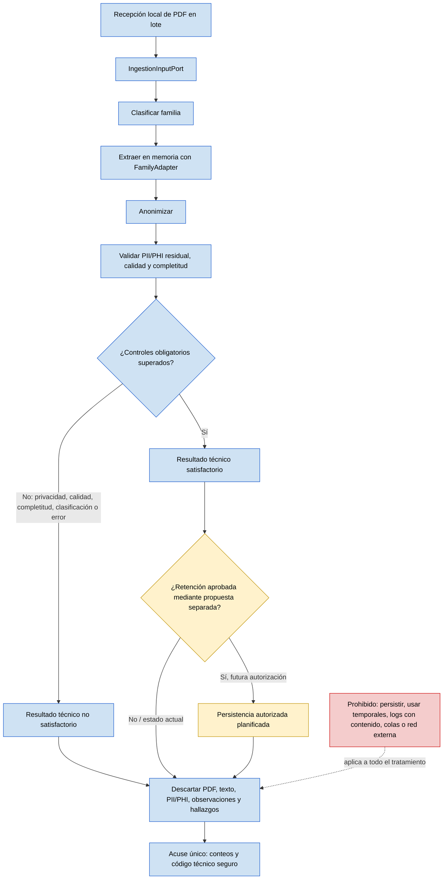

# Arquitectura objetivo de la ingesta clínica

Este documento muestra el destino arquitectónico: un núcleo hexagonal que procesa documentos clínicos de forma efímera y sólo abre capacidades adicionales mediante sus puertas de aprobación. No describe una autorización para retener datos ni para conectar infraestructura todavía no aprobada.

## Propósito y leyenda

El objetivo es mantener las reglas de clasificación, privacidad, calidad y decisión dentro del núcleo, independientes de la UI y de cualquier tecnología externa.

| Marca | Significado |
| --- | --- |
| **Implementado** | Capacidad indicada como completada en las tareas del cambio. |
| **Objetivo vigente** | Límite o comportamiento que la arquitectura debe preservar. |
| **Planificado / condicionado** | Capacidad futura; no debe implementarse ni habilitarse hasta cumplir su puerta de aprobación. |
| **Prohibido en la entrega actual** | Capacidad o retención que no forma parte del alcance actual. |

## Diagrama hexagonal objetivo

```mermaid
flowchart LR
    actor_user[Persona usuaria en navegador local]
    inbound_ui[Adaptador de entrada: carga manual local]
    inbound_port[Puerto de entrada: IngestionInputPort]

    subgraph hex_core[Hexágono: aplicación y dominio]
        use_case[Caso de uso: procesar documento]
        classify[Clasificación por familia]
        extract[Extracción transitoria]
        anonymize[Anonimización]
        validate[Validación residual de PII/PHI, calidad y completitud]
        decision[Política de decisión]
        domain[Dominio: inventario, estados de campo y reglas clínicas]

            out_family[Puerto de salida: FamilyAdapter]

            subgraph future_ports[Puertos futuros / condicionados]
                out_source[Puerto de salida: fuente de documento autorizada]
                out_store[Puerto de salida: almacenamiento de observaciones aprobadas]
            end
    end

        family_lab[Adaptador de salida: laboratorio en memoria]
        subgraph future_adapters[Adaptadores futuros / condicionados]
            family_future[Adaptadores de salida: ecocardiografía y ECG]
            source_future[Adaptador de salida: fuente autorizada]
            store_future[Adaptador de salida: persistencia autorizada]
        end
    safe_ack[Salida técnica segura: acuse de lote]
    discard[Objetivo vigente: descarte en memoria]
    prohibited[Prohibido actualmente: BD, temporales, logs con contenido, colas y red externa]

    actor_user --> inbound_ui --> inbound_port --> use_case
    use_case --> classify --> extract --> anonymize --> validate --> decision
    use_case --- domain
    extract --> out_family
    use_case -. futuro, si se autoriza .-> out_source
    out_family --> family_lab
    out_family -. futuro y con aprobación .-> family_future
    out_source -. futuro y con aprobación .-> source_future

    decision -. sólo si se aprueba retención .-> out_store
    out_store -. planificado; tecnología pendiente .-> store_future
    extract --> discard
    anonymize --> discard
    validate --> discard
    decision --> discard
    discard --> safe_ack

    classDef implemented fill:#d9ead3,stroke:#38761d,color:#000;
    classDef objective fill:#cfe2f3,stroke:#1155cc,color:#000;
    classDef planned fill:#fff2cc,stroke:#bf9000,color:#000;
    classDef prohibited fill:#f4cccc,stroke:#cc0000,color:#000;
    class actor_user,inbound_ui,inbound_port,use_case,classify,extract,anonymize,validate,decision,out_family,family_lab,safe_ack implemented;
    class domain,discard objective;
    class out_source,out_store,family_future,source_future,store_future planned;
    class prohibited prohibited;
```

El adaptador de laboratorio en memoria y el flujo local son **implementados**. Ecocardiografía, ECG, una fuente autorizada alternativa y la persistencia son **planificados / condicionados**. En particular, el puerto de almacenamiento representa el objetivo hexagonal ilustrado en `hexagonal.md`; no autoriza un `ApprovedObservationStore`, PostgreSQL ni otra tecnología en la entrega actual.

**Trazabilidad de las marcas:** “Implementado” significa que la capacidad fue completada dentro de este cambio, no que esté habilitada para producción. Las tareas 1.1 y 1.2 del [plan](../../openspec/changes/ingesta-pdf-clinicos/tasks.md) respaldan el núcleo efímero y el adaptador de laboratorio; la tarea 2.1 respalda anonimización, validación residual y descarte; las tareas 3.1 y 3.2 respaldan la UI local, la carga por lote y el acuse seguro.

## Flujo objetivo de procesamiento por documento

La persistencia no es la salida normal del flujo actual: antes de cualquier uso debe existir una propuesta aprobada que defina propósito, retención, acceso, esquema, trazabilidad y controles de privacidad. Incluso ante rechazo, todos los datos transitorios se descartan; sólo puede mantenerse el código técnico seguro el tiempo necesario para componer el acuse del lote.

## Capas y restricciones

| Capa | Responsabilidad objetivo | Componentes | Restricciones |
| --- | --- | --- | --- |
| Actores y entrada | Iniciar una carga manual local y recibir un acuse final. | Persona usuaria, navegador local, adaptador de carga, `IngestionInputPort`. | Sin red externa, autenticación, API, selector u observador de carpetas, integración hospitalaria, cola ni *broker*. La UI no muestra nombres ni contenido clínico. |
| Aplicación | Orquestar el procesamiento síncrono, archivo por archivo, desacoplado del origen. | Caso de uso, clasificación, anonimización, `PrivacyValidator`, política de decisión y `BatchAcknowledgement`. | Sólo devuelve conteos y códigos técnicos seguros; no expone detalles de validación ni resultados clínicos. |
| Dominio | Expresar reglas clínicas, estados y decisión sin conocer infraestructura. | Inventario versionado, estados `verified`, `not_present`, `missing`, `ambiguous`, `malformed` y `truncated`; reglas de calidad y completitud. | Un campo no puede omitirse silenciosamente. Un control obligatorio incompleto, PII/PHI residual o campo requerido no verificable bloquea el resultado satisfactorio. |
| Salida efímera | Resolver la familia documental durante el tratamiento. | Puerto `FamilyAdapter`; adaptador de laboratorio en memoria (**implementado**). | PDF, texto, valores, observaciones y procedencia son transitorios y se descartan en éxito y error. |
| Salida condicionada | Conectar capacidades futuras detrás de puertos. | Fuente autorizada, adaptadores de ecocardiografía/ECG y almacenamiento de observaciones aprobadas (**planificados**). | Requieren sus aprobaciones y evidencia específicas. Persistencia además requiere propuesta separada; la tecnología no está decidida. |
| Retención y canales laterales | Evitar almacenamiento o exposición accidental. | Descarte en memoria y acuse técnico seguro. | Prohibidos PDFs, texto, PII/PHI, datos clínicos, observaciones, resultados, temporales y estados intermedios en base de datos, archivos, logs, mensajes o cargas de cola. |

## Límites y no objetivos

- La arquitectura objetivo es un servicio modular, no un conjunto de microservicios.
- La entrega actual no habilita persistencia, PostgreSQL, migraciones, mensajería, fuentes remotas, APIs públicas ni servicios de red.
- Calidad habilitable requiere corpus autorizado, inventario versionado y umbrales aprobados; sin ellos ninguna versión es apta para uso productivo.
- Ecocardiografía y ECG requieren aprobación clínica y de privacidad, inventario, corpus y umbrales propios. Para ECG, la señal del trazado sigue excluida.
- No se producen ni retienen *features*, *targets* o datasets de ML; esa capacidad requiere una aprobación independiente.

## Fuentes

- [`hexagonal.md`](hexagonal.md): límites hexagonales, puertos, adaptadores y dirección de dependencias.
- [`proposal.md`](../../openspec/changes/ingesta-pdf-clinicos/proposal.md), [`design.md`](../../openspec/changes/ingesta-pdf-clinicos/design.md) y [`tasks.md`](../../openspec/changes/ingesta-pdf-clinicos/tasks.md): estado de entregas, límites y puertas futuras.
- Especificaciones de [`ingesta clínica anonimizada`](../../openspec/changes/ingesta-pdf-clinicos/specs/ingesta-clinica-anonimizada/spec.md), [`carga manual local`](../../openspec/changes/ingesta-pdf-clinicos/specs/carga-manual-local/spec.md), [`validación`](../../openspec/changes/ingesta-pdf-clinicos/specs/validacion-privacidad-y-calidad/spec.md), [`observaciones`](../../openspec/changes/ingesta-pdf-clinicos/specs/observaciones-clinicas/spec.md), [`calidad`](../../openspec/changes/ingesta-pdf-clinicos/specs/calidad-de-extraccion/spec.md) y [`ML`](../../openspec/changes/ingesta-pdf-clinicos/specs/datasets-ml-derivados/spec.md).
