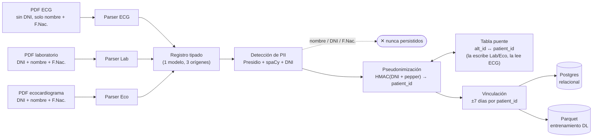

# Pipeline de extracción y anonimización

Este documento explica cómo un PDF clínico (ECG, laboratorio o ecocardiograma) se convierte en un
registro estructurado y anonimizado, y por qué se eligió cada pieza del stack. Es la versión
"documentación viva" del diseño formal en
[`openspec/changes/pdf-pii-anonymization/design.md`](../openspec/changes/pdf-pii-anonymization/design.md);
ante cualquier discrepancia, el `design.md` es la fuente de verdad.

## Diagrama de flujo

**Lectura del diagrama**: los tres tipos de documento solo se tocan en su parser — todo lo que
sigue (`Registro tipado` en adelante) es compartido. Agregar un 4to tipo de documento mañana
significa escribir una clase de parser nueva, sin tocar el resto del pipeline. El ECG es el único
documento sin DNI propio: resuelve su `patient_id` consultando la tabla puente que laboratorio y
ecocardiograma completan (ellos sí traen DNI). La PII cruda muere en el paso de pseudonimización —
de ahí en más todo lo que circula es un `patient_id` irreversible.

Dos caminos secundarios no están en el diagrama porque no cambian el mecanismo central: un
documento inválido (layout no reconocido, PII sin resolver) se aísla en **cuarentena** sin abortar
el lote, y cada **PDF original** se retiene cifrado aparte como fuente de verdad para reprocesar
— nunca se mezcla con el dataset anonimizado. Detalle completo en `design.md`.

## Validación piloto antes de escalar

Antes de medir 1k, 10k o 100k documentos, el repositorio ejecuta un piloto offline de 50 casos
sintéticos deterministas. Incluye episodios completos, el límite exacto de siete días, separación
a ocho días, estudios faltantes, asociaciones ambiguas, duplicados por huella y PDFs corruptos.
Los 154 archivos físicos se reducen a 149 entradas únicas y recorren el pipeline real hasta una
salida temporal en memoria; el oráculo conserva sólo estados y conteos, nunca nombres, DNI ni
fechas de nacimiento.

La compuerta mantiene los valores identificatorios ficticios únicamente en memoria durante la
corrida y contrasta cada uno contra los 120 registros anonimizados reales. El reporte persiste
sólo la cantidad inspeccionada y el resultado agregado; no conserva esos valores transitorios.
La construcción final elimina además el nombre del técnico ECG antes de escribir la salida.

El piloto aprobado produce 40 episodios, 120 documentos publicables y 29 cuarentenas esperadas.
Esto demuestra el comportamiento funcional del lote y su aislamiento de fallos, **no** capacidad
institucional. El rendimiento y los límites de CPU, memoria y almacenamiento deben medirse todavía
en los escalones 1k/10k/100k sobre hardware representativo.

## Librerías principales

Para cada una: **qué es**, **cómo la usamos**, **por qué la elegimos** y **qué descartamos**.
El detalle completo de la comparación está en Engram
(`sdd/pdf-pii-anonymization/explore`) y en las Architecture Decisions de `design.md`.

### PyMuPDF (`pymupdf`, import `fitz`)

- **Qué es**: binding Python sobre MuPDF, un motor C de renderizado/parsing de PDF. Extrae texto,
  posición (bounding boxes) e imágenes.
- **Cómo la usamos**: en `extraction/pymupdf_text.py`, para convertir cada PDF en bloques de texto
  con su posición. Los 3 layouts (ECG, laboratorio, ecocardiograma) son PDFs de **texto nativo**
  (no escaneados), así que esta extracción alcanza sin OCR.
- **Por qué**: es determinístico, rápido, corre 100% local (sin enviar el documento a ningún
  servicio) y preserva las coordenadas del texto — relevante si en el futuro se necesita ubicar
  un campo específico dentro del layout.
- **Alternativas descartadas**:
  - `pdfplumber` — más cómodo para tablas, pero notablemente más lento a la escala de ~100k
    documentos.
  - `pdfminer.six` — capa más baja, layout menos confiable que PyMuPDF para este caso.
  - OCR (Tesseract o servicios cloud como AWS Textract / Google Document AI) — descartado como
    ruta principal porque los 3 documentos ya tienen texto seleccionable; los servicios cloud
    además quedaron excluidos por la decisión de offline 100% (ver Presidio más abajo). Queda
    como fallback futuro si aparece un layout escaneado.

### Presidio (`presidio-analyzer`) + spaCy (`es_core_news_lg`)

- **Qué son**: Presidio es un framework de Microsoft para detección de PII — no es un modelo en sí,
  sino un orquestador de "recognizers" (reconocedores) que combina reglas, regex y modelos de NER,
  cada uno con un score de confianza. spaCy es la librería de NLP que le provee el reconocedor de
  entidades nombradas (`PERSON`, entre otras) vía el modelo `es_core_news_lg`, entrenado en
  español.
- **Cómo los usamos**: en `pii/engine.py`, Presidio corre dos tipos de recognizer sobre cada
  registro parseado — un `PatternRecognizer` **custom** para DNI argentino (`pii/recognizers/dni_ar.py`,
  regex + validación de formato + contexto de palabras como "DNI"/"documento") y el
  `SpacyRecognizer` (es_core_news_lg) para nombres de persona. Corre también sobre texto libre
  (ej. las conclusiones del ecocardiograma), no solo sobre los campos del header, porque el nombre
  del paciente reaparece en el texto dictado.
- **Por qué**: en anonimización, un falso negativo es una fuga real de DNI — no alcanza con
  regex sola (frágil ante nombres compuestos, apellidos poco comunes, o cualquier número de 7-8
  dígitos que no sea DNI) ni con NER sola (no valida formato/checksum de DNI). Presidio + spaCy
  corre **100% local**, sin llamar a ningún servicio externo — obligatorio porque el DNI es dato
  sensible bajo la Ley 25.326 y el protocolo de investigación exige confidencialidad.
- **Alternativas descartadas**:
  - Regex-only — falsos positivos altos en DNI (cualquier número de 7-8 dígitos) y frágil para
    nombres (no distingue "Juan Pérez" persona de una entidad con apellido en el nombre).
  - Modelos transformer más grandes (BETO, RoBERTa-BNE fine-tuned) — mejor recall potencial, pero
    mayor costo computacional (GPU deseable) para procesar ~100k documentos; se evalúa como mejora
    futura si `es_core_news_lg` no alcanza el umbral de calidad al calibrar contra el corpus real.
  - APIs cloud de NER/PII (AWS Comprehend Medical, Google DLP, Azure PII detection) — descartadas
    de raíz: envían el contenido del documento (con DNI) a un tercero, incompatible con la
    decisión de offline 100%.

### Pseudonimización con HMAC (`hmac` + `hashlib`, stdlib)

- **Qué es**: HMAC (Hash-based Message Authentication Code) combina un hash criptográfico con una
  clave secreta (acá llamada *pepper*). No es una librería externa — es parte de la biblioteca
  estándar de Python.
- **Cómo la usamos**: `patient_id = HMAC-SHA256(key=pepper, msg=DNI canonicalizado)`. Cuando el
  documento no trae DNI (el caso del ECG), se calcula además `patient_alt_id` a partir de
  nombre normalizado + fecha de nacimiento. El pepper vive en un almacén separado del dataset
  (variable de entorno inyectada desde Vault/KMS, o archivo cifrado con permisos restringidos),
  nunca en el repositorio ni junto a los datos.
- **Por qué**: HMAC con pepper secreto es determinístico — el mismo DNI siempre produce el mismo
  `patient_id`, lo que permite vincular ECG + laboratorio + ecocardiograma del mismo paciente —
  pero no es invertible sin conocer el pepper.
- **Alternativas descartadas**:
  - Hash simple del DNI (`SHA-256(dni)`, sin clave) — rechazado: el espacio de DNIs argentinos es
    enumerable (8 dígitos), así que un hash sin clave se revierte por fuerza bruta en minutos.
  - Cifrado reversible del DNI — rechazado: crearía un camino de re-identificación que el
    protocolo de investigación no necesita ni autoriza.

### Celery + Redis

- **Qué son**: Celery es una librería de colas de tareas asíncronas para Python; Redis actúa como
  *broker* (transporta los mensajes de tarea) y opcionalmente como backend de resultados.
- **Cómo los usamos**: cada documento a procesar se encola como una tarea Celery. El mensaje de
  cola transporta **solo** `{doc_id, uri, sha256}` — nunca el contenido del PDF ni datos
  extraídos — precisamente para que ninguna PII pueda terminar en una dead-letter queue.
- **Por qué**: procesar 100k documentos de forma síncrona no escala (sin reintentos, sin
  paralelismo, sin visibilidad de progreso). Una cola con worker pool permite procesar en
  paralelo, reintentar solo errores transitorios (IO, storage, DB — no errores de parsing, que
  son deterministas y van directo a cuarentena) y agregar más workers sin tocar el código del
  pipeline.
- **Alternativas descartadas**:
  - Procesamiento síncrono request/response — válido solo para probar los 3 documentos de hoy;
    inviable a escala.
  - BullMQ (Node) — descartado junto con la opción de usar Node como runtime (ver más abajo).
  - RabbitMQ como broker — Celery lo soporta, pero Redis alcanza para este volumen y ya se usa
    en otras partes del proyecto; se puede migrar sin cambiar la lógica de tareas si hiciera falta.

### PostgreSQL (vía SQLAlchemy) + Parquet (vía PyArrow)

- **Qué son**: PostgreSQL es la base relacional donde vive el catálogo de episodios, la tabla de
  vinculación (`patient_link`) y los resultados normalizados. Parquet es un formato de archivo
  columnar; PyArrow es la librería que lo lee/escribe desde Python.
- **Cómo los usamos**: Postgres es el "sistema de registro" — impone integridad referencial sobre
  el linkage, que es la parte más delicada del diseño. El laboratorio, que tiene un panel de
  analitos variable, se modela en formato **largo/EAV** (`episodio, analito, valor, unidad,
  referencia`) en vez de una columna por analito. Desde Postgres se exporta a Parquet particionado
  (`tipo_documento/año`) como capa de consumo para el entrenamiento del modelo de deep learning.
- **Por qué**: la forma real del dato es mixta, no "documental" — ECG y ecocardiograma tienen
  esquema fijo, y lo único variable es qué analitos de laboratorio están presentes en cada caso,
  que es un problema clásico de tabla larga, no de documentos sin esquema. 100k registros es un
  volumen trivial para Postgres. Parquet cubre lo que Postgres hace mal: lecturas columnares
  repetidas, una por época de entrenamiento.
- **Alternativas descartadas**:
  - SQL con el laboratorio en tabla ancha (una columna por analito) — rechazado: extremadamente
    disperso (sparse) y requiere una migración de esquema cada vez que aparece un analito nuevo.
  - Base NoSQL documental (MongoDB) — absorbe la forma variable del laboratorio, pero sin
    validación de esquema, con los joins de vinculación resueltos en la aplicación (no en la base)
    y con lecturas más lentas a 100k documentos para entrenamiento.

### Pydantic

- **Qué es**: librería de validación y modelado de datos basada en type hints de Python.
- **Cómo la usamos**: para los modelos de dominio (`ParsedDocument`, `AnonymizedRecord`, etc.) y
  para envolver cualquier campo con PII en un tipo tipo `SecretStr`, cuyo `__repr__` está
  redactado — así, si alguien loguea o imprime el objeto por accidente, no se filtra el valor
  real.
- **Por qué**: da validación de esquema (versión, tipos) "gratis" en cada frontera del pipeline, y
  el patrón `SecretStr` es una barrera adicional (de las cuatro descritas en `design.md`) contra
  fuga de PII en logs.
- **Alternativas descartadas**: `dataclasses` puras de la stdlib — se consideraron para el modelo
  interno (`ParsedDocument` usa `@dataclass(frozen=True)` en el diseño actual), pero Pydantic se
  mantiene para los modelos que cruzan fronteras serializables (persistencia, mensajes) por la
  validación y el tipo `SecretStr` ya construido.

### Lenguaje: Python (descartando Node/TypeScript)

No es una librería, pero es la decisión que condiciona todas las anteriores: se evaluó Node como
alternativa (con `pdf-lib`/`pdf.js` para extracción) y se descartó porque el ecosistema de NER en
español self-hosted es mucho más débil ahí — no hay equivalente maduro a Presidio + spaCy en npm.
Elegir Node hubiera significado terminar llamando a un microservicio Python para la parte más
riesgosa del sistema (detección de PII), sumando complejidad de integración sin ningún beneficio.
