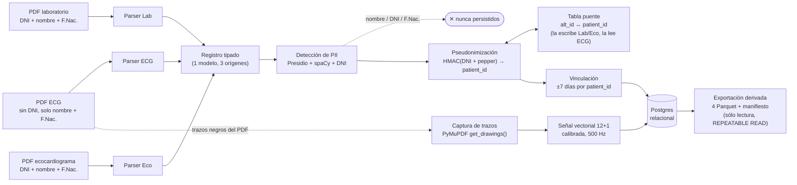

# Pipeline de extracción y anonimización

Este documento explica cómo un PDF clínico (ECG, laboratorio o ecocardiograma) se convierte en un
registro estructurado y anonimizado, y por qué se eligió cada pieza del stack. Es la versión
"documentación viva" del diseño formal en
[`openspec/changes/pdf-pii-anonymization/design.md`](../openspec/changes/pdf-pii-anonymization/design.md);
ante cualquier discrepancia, el `design.md` es la fuente de verdad.

## Diagrama de flujo

**Lectura del diagrama**: los tres tipos de documento solo se tocan en su parser — todo lo que
sigue (`Registro tipado` en adelante) es compartido. Agregar un 4to tipo de documento mañana
significa escribir una clase de parser nueva, sin tocar el resto del pipeline. El ECG es el único
documento sin DNI propio: resuelve su `patient_id` consultando la tabla puente que laboratorio y
ecocardiograma completan (ellos sí traen DNI). La PII cruda muere en el paso de pseudonimización —
de ahí en más todo lo que circula es un `patient_id` irreversible.

Dos caminos secundarios no están en el diagrama porque no cambian el mecanismo central: un
documento inválido (layout no reconocido, PII sin resolver) se aísla en **cuarentena** sin abortar
el lote, y cada **PDF original** se retiene cifrado aparte como fuente de verdad para reprocesar
— nunca se mezcla con el dataset anonimizado. Detalle completo en `design.md`.

## Validación piloto antes de escalar

Antes de medir 1k, 10k o 100k documentos, el repositorio ejecuta un piloto offline de 50 casos
sintéticos deterministas. Incluye episodios completos, el límite exacto de siete días, separación
a ocho días, estudios faltantes, asociaciones ambiguas, duplicados por huella y PDFs corruptos.
Los 154 PDFs de entrada se reducen a 149 entradas únicas y recorren el pipeline real hasta una
salida temporal en memoria; el oráculo conserva sólo estados y conteos, nunca nombres, DNI ni
fechas de nacimiento.

La compuerta mantiene los valores identificatorios ficticios únicamente en memoria durante la
corrida y contrasta cada uno contra los 120 registros anonimizados reales. El reporte persiste
sólo la cantidad inspeccionada y el resultado agregado; no conserva esos valores transitorios.
La construcción final elimina además el nombre del técnico ECG antes de escribir la salida.

El piloto aprobado produce 40 episodios, 120 documentos publicables y 29 cuarentenas esperadas.
Esto demuestra el comportamiento funcional del lote y su aislamiento de fallos, **no** capacidad
institucional. El rendimiento y los límites de CPU, memoria y almacenamiento deben medirse todavía
en los escalones 1k/10k/100k sobre hardware representativo.

## Primer escalón de carga: 1.000 PDFs

El runner reejecutable `tests/carga/ejecutar_corpus.py` genera 1.000 PDFs distintos salvo dos duplicados
intencionales para probar idempotencia. La mezcla contiene 320 episodios completos, límites de
siete y ocho días, faltantes, asociaciones ambiguas y un archivo corrupto. En la ejecución local
del 23 de agosto de 2026 se inventariaron 998 documentos únicos: 972 fueron aprobados dentro de
324 episodios y 26 quedaron en cuarentena según el oráculo; no hubo reintentos ni PII en salida.

La corrida más reciente (tras migrar la ingesta a `FuenteLocal` con enumeración perezosa, PR4 de
`puerto-de-ingesta`) tardó 218,64 segundos: 4,574 PDFs de entrada/s y 4,564 documentos únicos/s —
una mejora de ~7,9 s (~3,5 %) sobre la medición previa (226,54 s), consistente con que la
enumeración perezosa no debía empeorar tiempo ni memoria. El pico *lifetime* del proceso fue
145.698.816 bytes (antes 145.432.576 bytes; diferencia de ~0,18 %, dentro del ruido de medición).
La composición del corpus (998 únicos, 2 duplicados, 972 aprobados, 324 episodios, 26 cuarentenas
por el mismo desglose de motivos) se mantuvo idéntica: no hay regresión funcional. Cada ejecución
usa un directorio UUID aislado
y agrega sus métricas al reporte estable, por lo que puede repetirse sin mezclar corpus anteriores.
El workspace conserva 1.005 PDFs de staging y 1.000 PDFs de entrada durante la corrida: esta
medición incluye ese doble I/O y no presenta las entradas como el total de archivos almacenados.

Son reales la extracción PyMuPDF, detección, parser, reconciliación, coordinación y construcción
anonimizada. El motor PII/Presidio-spaCy, HMAC/resolutor, PostgreSQL y almacenamiento productivo
se reemplazan por adaptadores offline o no participan. La compuerta compara todos los literales
sintéticos efímeros contra los registros finales, pero **no valida el NER institucional**. Por eso
esta medición no demuestra todavía capacidad institucional. El escalón 10k se documenta a
continuación y 100k permanece pendiente; 100k no se ejecutará en CI.

## Segundo escalón de carga: 10.000 PDFs

El perfil 10k escala la misma composición y el mismo oráculo del perfil 1k, sin duplicar la lógica
del pipeline. Genera exactamente 10.000 PDFs de entrada en una carpeta UUID aislada: 9.980 son
únicos y 20 son duplicados intencionales. Mantiene proporcionalmente completos, límites de siete
y ocho días, faltantes, ambigüedad y corrupción. Es un comando local deliberado y no integra la
suite normal de CI. Además conserva 10.050 PDFs en `generados/`: el workspace ocupa 20.050 PDFs
entre staging y entrada, y ambos flujos de escritura forman parte del tiempo end-to-end.

La ejecución del 23 de agosto de 2026 aprobó 3.240 episodios y 9.720 documentos. Los otros 260
documentos coincidieron con las cuarentenas esperadas: 80 por cobertura ambigua, 170 por cobertura
incompleta y 10 por parseo incompleto. Hubo cero fallos inesperados, cero reintentos y cero
literales PII sintéticos en los registros finales; el oráculo completo fue aprobado.

El tiempo end-to-end fue 2.874,23 segundos (47,90 minutos), con 3,479 PDFs de entrada/s y 3,472
documentos únicos/s. La memoria pico *lifetime* del proceso fue 315.772.928 bytes. El preflight
considera tanto staging como entrada: estimó 1.085.851.860 bytes de disco, 1.454.325.760 bytes de
memoria y 2.265,41137 segundos, frente a 888.964.816.896 bytes de disco y 6.227.922.944 bytes de
memoria disponibles al migrar el reporte. Estas métricas agregadas y su aprobación quedan allí;
PDFs y reporte se mantienen bajo `tmp/carga_10000/`, fuera de Git.

Esta prueba aumenta la evidencia de volumen, pero conserva los límites del escalón 1k: mide
extracción, detección de tipo, parsers, reconciliación, coordinación y construcción reales con
adaptadores offline. No mide Presidio-spaCy institucional, HMAC real, PostgreSQL ni storage
productivo. Por eso NO certifica todavía la capacidad del despliegue institucional; 100k
y la prueba sobre la infraestructura final siguen pendientes.

## Señal de ECG y dataset vinculado exportado

Cambio `senal-ecg-y-dataset-vinculado` (`openspec/changes/senal-ecg-y-dataset-vinculado/`):
agrega dos piezas nuevas al pipeline descrito arriba, ambas de sólo lectura sobre Postgres,
sin introducir una segunda ruta de escritura.

- **Extracción de la señal vectorial de ECG**: `extraccion/trazos_pymupdf.py` captura los
  trazos negros del PDF con `PyMuPDF.get_drawings()`; `extraccion/senal_ecg.py` +
  `dominio/senal_ecg.py` calibran por los 4 pulsos de referencia, asignan cada trazo a su
  derivación (12 derivaciones + tira de ritmo) y muestrean a 500 Hz, con validación
  todo-o-nada (una señal inconsistente se descarta entera, nunca se persiste a medias). El
  resultado se persiste en la tabla `senal_ecg` (PK/FK 1:1 con `estudio`, `SET STORAGE
  EXTERNAL` en Postgres), codificada como `int16` µV + máscara de bits, ambos comprimidos
  con `zlib` (`salida/codec_senal.py`). Si la señal no se puede reconstruir, el documento
  sigue publicándose igual: `ecg.senal` se agrega a `campos_no_extraidos` (degradación
  explícita, no cuarentena) — ver `parseo/ecg_mortara.py` y
  `reconciliacion/ecg_mortara.py`.
- **Exportación derivada** (`salida/exportacion.py`, subcomando `anonimizacion exportar`):
  proyecta Postgres a 4 archivos Parquet (`episodios`, `ecg`, `laboratorio`, `eco`) +
  `manifiesto.json`, dentro de una única transacción `REPEATABLE READ`, paginando por clave
  (nunca `OFFSET`). Postgres sigue siendo la única fuente de verdad — exportar no muta nada,
  es regenerable en cualquier momento, y agrupa por `estudio.id_episodio` (la vinculación por
  paciente + ventana de 7 días ya está resuelta al escribir cada `estudio`, no se recalcula
  acá). Lista blanca de columnas explícita y falsable por tabla: `clave_documento`,
  `corrida_id`, cualquier `id_medico*` y el texto libre del eco quedan afuera; `adicionales_json`
  vuelve a filtrarse contra `_CLAVES_PERSONAL` como defensa en profundidad, sin confiar
  ciegamente en que la escritura ya lo hizo. El manifiesto declara versión de esquema,
  frecuencia (500 Hz), unidad (µV), orden de derivaciones, ventanas por columna y hash de
  cada archivo, pensado como contrato para el consumidor externo (`modelo_hvi`) sin que este
  repo importe ese proyecto.

**Esto no revierte la decisión de eliminar la primera versión de la exportación Parquet**
(ver "Alternativas descartadas" de PostgreSQL más abajo) — la satisface: aquella advertía que
si en el futuro hacía falta exportar a Parquet para entrenamiento, debía ser una consulta de
lectura sobre Postgres, no una segunda ruta de escritura paralela. Esta vez, además, sí tiene
consumidor real: el investigador y `modelo_hvi`.

### Auditoría de PII sobre el dataset exportado

`tests/pii/test_auditoria_exportacion_sin_pii.py` (tasks.md 4.3, cierra la tarea 5.2 de
`operacion-segura-y-escalable`): genera un corpus sintético con PII conocida (nombre, DNI,
fecha de nacimiento, número de petición/estudio), lo procesa de punta a punta por el pipeline
real contra una base real, exporta el dataset resultante y pasa el verificador lineal de PII
(`tests/pii/verificador_lineal.py`, Aho-Corasick) sobre el contenido completo de los 4 Parquet
(todas las columnas, incluidos `adicionales_json` y las listas de la señal de ECG) y
`manifiesto.json`. Corrida del 15/09/2026: **0 coincidencias** contra los valores de PII
sintéticos conocidos. La auditoría se demuestra falsable en el mismo archivo: un segundo test
inyecta a propósito uno de esos valores en una fila real ya exportada y confirma que el mismo
verificador la detecta (`coincidencias > 0`) — sin ese test, un verificador roto que siempre
devolviera 0 pasaría la auditoría igual.

Esta auditoría encontró además un defecto real en `salida/exportacion.py`: pyarrow 25.0.1 no
hace un round-trip correcto a través de Parquet de una columna `FixedSizeListArray` cuando
TODAS las filas de una página son `None` (`ArrowInvalid: Expected all lists to be of size=N
but index K had size=0`, reproducido también con `FixedSizeListArray.from_arrays` directo) —
exactamente el caso de cualquier página cuyos ECG todavía no tengan señal capturada, nada
hipotético dado el estado actual de cobertura del extractor. Corregido cambiando
`muestras_uv`/`mascara` de lista de tamaño fijo a lista de tamaño variable en el esquema
Parquet; el invariante de largo exacto (60000 = 12×5000 muestras) lo sigue garantizando
`SenalEcg.__post_init__` para toda fila no nula, sólo cambió el tipo de columna.

## Librerías principales

Para cada una: **qué es**, **cómo la usamos**, **por qué la elegimos** y **qué descartamos**.
El detalle completo de la comparación está en Engram
(`sdd/pdf-pii-anonymization/explore`) y en las Architecture Decisions de `design.md`.

### PyMuPDF (`pymupdf`, import `fitz`)

- **Qué es**: binding Python sobre MuPDF, un motor C de renderizado/parsing de PDF. Extrae texto,
  posición (bounding boxes) e imágenes.
- **Cómo la usamos**: en `extraction/pymupdf_text.py`, para convertir cada PDF en bloques de texto
  con su posición. Los 3 layouts (ECG, laboratorio, ecocardiograma) son PDFs de **texto nativo**
  (no escaneados), así que esta extracción alcanza sin OCR.
- **Por qué**: es determinístico, rápido, corre 100% local (sin enviar el documento a ningún
  servicio) y preserva las coordenadas del texto — relevante si en el futuro se necesita ubicar
  un campo específico dentro del layout.
- **Alternativas descartadas**:
  - `pdfplumber` — más cómodo para tablas, pero notablemente más lento a la escala de ~100k
    documentos.
  - `pdfminer.six` — capa más baja, layout menos confiable que PyMuPDF para este caso.
  - OCR (Tesseract o servicios cloud como AWS Textract / Google Document AI) — descartado como
    ruta principal porque los 3 documentos ya tienen texto seleccionable; los servicios cloud
    además quedaron excluidos por la decisión de offline 100% (ver Presidio más abajo). Queda
    como fallback futuro si aparece un layout escaneado.

### Presidio (`presidio-analyzer`) + spaCy (`es_core_news_lg`)

- **Qué son**: Presidio es un framework de Microsoft para detección de PII — no es un modelo en sí,
  sino un orquestador de "recognizers" (reconocedores) que combina reglas, regex y modelos de NER,
  cada uno con un score de confianza. spaCy es la librería de NLP que le provee el reconocedor de
  entidades nombradas (`PERSON`, entre otras) vía el modelo `es_core_news_lg`, entrenado en
  español.
- **Cómo los usamos**: en `pii/engine.py`, Presidio corre dos tipos de recognizer sobre cada
  registro parseado — un `PatternRecognizer` **custom** para DNI argentino (`pii/recognizers/dni_ar.py`,
  regex + validación de formato + contexto de palabras como "DNI"/"documento") y el
  `SpacyRecognizer` (es_core_news_lg) para nombres de persona. Corre también sobre texto libre
  (ej. las conclusiones del ecocardiograma), no solo sobre los campos del header, porque el nombre
  del paciente reaparece en el texto dictado.
- **Por qué**: en anonimización, un falso negativo es una fuga real de DNI — no alcanza con
  regex sola (frágil ante nombres compuestos, apellidos poco comunes, o cualquier número de 7-8
  dígitos que no sea DNI) ni con NER sola (no valida formato/checksum de DNI). Presidio + spaCy
  corre **100% local**, sin llamar a ningún servicio externo — obligatorio porque el DNI es dato
  sensible bajo la Ley 25.326 y el protocolo de investigación exige confidencialidad.
- **Alternativas descartadas**:
  - Regex-only — falsos positivos altos en DNI (cualquier número de 7-8 dígitos) y frágil para
    nombres (no distingue "Juan Pérez" persona de una entidad con apellido en el nombre).
  - Modelos transformer más grandes (BETO, RoBERTa-BNE fine-tuned) — mejor recall potencial, pero
    mayor costo computacional (GPU deseable) para procesar ~100k documentos; se evalúa como mejora
    futura si `es_core_news_lg` no alcanza el umbral de calidad al calibrar contra el corpus real.
  - APIs cloud de NER/PII (AWS Comprehend Medical, Google DLP, Azure PII detection) — descartadas
    de raíz: envían el contenido del documento (con DNI) a un tercero, incompatible con la
    decisión de offline 100%.

### Pseudonimización con HMAC (`hmac` + `hashlib`, stdlib)

- **Qué es**: HMAC (Hash-based Message Authentication Code) combina un hash criptográfico con una
  clave secreta (acá llamada *pepper*). No es una librería externa — es parte de la biblioteca
  estándar de Python.
- **Cómo la usamos**: `patient_id = HMAC-SHA256(key=pepper, msg=DNI canonicalizado)`. Cuando el
  documento no trae DNI (el caso del ECG), se calcula además `patient_alt_id` a partir de
  nombre normalizado + fecha de nacimiento. El pepper vive en un almacén separado del dataset
  (variable de entorno inyectada desde Vault/KMS, o archivo cifrado con permisos restringidos),
  nunca en el repositorio ni junto a los datos.
- **Por qué**: HMAC con pepper secreto es determinístico — el mismo DNI siempre produce el mismo
  `patient_id`, lo que permite vincular ECG + laboratorio + ecocardiograma del mismo paciente —
  pero no es invertible sin conocer el pepper.
- **Alternativas descartadas**:
  - Hash simple del DNI (`SHA-256(dni)`, sin clave) — rechazado: el espacio de DNIs argentinos es
    enumerable (8 dígitos), así que un hash sin clave se revierte por fuerza bruta en minutos.
  - Cifrado reversible del DNI — rechazado: crearía un camino de re-identificación que el
    protocolo de investigación no necesita ni autoriza.

### Concurrencia: `ProcessPoolExecutor` (stdlib)

- **Qué es**: `concurrent.futures.ProcessPoolExecutor`, de la biblioteca estándar de Python —
  un pool de procesos hijos en la misma máquina, sin broker ni servicio externo.
- **Cómo lo usamos**: `trabajadores/despacho_paralelo.py::despachar_en_paralelo` reparte los
  grupos (un paciente/episodio cada uno) entre los procesos del pool; cada hijo invoca
  `tareas.procesar_grupo(corrida_id, grupo)` en directo — la misma función que corre el camino
  secuencial (`procesos=1`), sin reimplementar nada del procesamiento. El grado de concurrencia
  no es "núcleos físicos" a secas: se midió que `MotorPii` (spaCy + Presidio) consume ~875 MB de
  RSS por proceso (medido con `K32GetProcessMemoryInfo`), así que el default es
  `min(heurística_de_núcleos_físicos, tope_conservador_fijo)` para no agotar la memoria de una
  máquina típica con varias copias del modelo cargadas a la vez (ver el razonamiento completo en
  `despacho_paralelo.py`). Si un hijo muere (`BrokenProcessPool`), el grupo que traía se
  reprocesa en aislamiento contra un pool de tamaño 1, con un tope de reintentos — la
  recuperación tiene un costo medido en recargas completas del modelo, contabilizado en
  `MetricasDespacho`.
- **Por qué**: procesar cientos de miles de documentos de forma síncrona no escala (sin
  paralelismo, sin visibilidad de progreso), pero el volumen objetivo (~100k documentos, una
  sola máquina del instituto) no justifica operar infraestructura distribuida — el paralelismo
  necesario cabe en un pool de procesos del mismo proceso padre.
- **Alternativas descartadas**:
  - Procesamiento síncrono (`procesos=1`) — válido para volúmenes chicos o depuración; sigue
    disponible como modo, no es el default a escala.
  - **Celery + Redis** (`auditoria-y-poda` E5, `trabajadores/app.py` + `@app.task` en
    `tareas.py`): se esbozó una integración completa (broker/backend configurables, política de
    reintentos con backoff, límite de concurrencia) pero **nunca tuvo llamador de producción**:
    ningún script ni el ejecutor del pipeline invocaba `.delay()`/`.apply_async()` — sólo un
    test lo ejercitaba — y no había servicio `redis` en `docker-compose.yml`. El paralelismo real
    siempre fue el `ProcessPoolExecutor` descrito arriba. Se retiró por completo (código, test,
    dependencias del `pyproject.toml`, variables de `deploy/`) en vez de mantenerse como
    capacidad declarada sin uso — si algún día hace falta escalar más allá de una máquina
    (workers distribuidos), el trabajo real es operar esa infraestructura (Redis, colas,
    despliegue de workers), no reactivar código que ya existía y nunca se ejercitó.
  - BullMQ (Node) — descartado junto con la opción de usar Node como runtime (ver más abajo).

### PostgreSQL (vía SQLAlchemy)

- **Qué es**: la base relacional donde vive el catálogo de episodios, la tabla de vinculación
  (`patient_link`) y los resultados normalizados. Es la ÚNICA salida del pipeline — fuente de
  verdad, no un destino entre varios.
- **Cómo la usamos**: Postgres es el "sistema de registro" — impone integridad referencial sobre
  el linkage, que es la parte más delicada del diseño. El laboratorio, que tiene un panel de
  analitos variable, se modela en formato **largo/EAV** (`episodio, analito, valor, unidad,
  referencia`) en vez de una columna por analito.
- **Por qué**: la forma real del dato es mixta, no "documental" — ECG y ecocardiograma tienen
  esquema fijo, y lo único variable es qué analitos de laboratorio están presentes en cada caso,
  que es un problema clásico de tabla larga, no de documentos sin esquema. 100k registros es un
  volumen trivial para Postgres.
- **Alternativas descartadas**:
  - SQL con el laboratorio en tabla ancha (una columna por analito) — rechazado: extremadamente
    disperso (sparse) y requiere una migración de esquema cada vez que aparece un analito nuevo.
  - Base NoSQL documental (MongoDB) — absorbe la forma variable del laboratorio, pero sin
    validación de esquema, con los joins de vinculación resueltos en la aplicación (no en la base)
    y con lecturas más lentas a 100k documentos.
  - **Primera versión de Parquet vía PyArrow (eliminada en `chore/resolver-codigo-desconectado`)**:
    existió una proyección columnar exportada desde Postgres (`salida/destinos/parquet.py`,
    `salida/publicador_bundles.py`) pensada como capa de consumo para entrenamiento de un modelo de
    deep learning. Nunca tuvo llamador de producción — ningún script ni el ejecutor del pipeline la
    invocaba, solo sus propios tests — así que se retiró junto con `pyarrow` como dependencia,
    dejando escrito que una futura exportación debía ser una consulta de lectura sobre Postgres, no
    una segunda ruta de escritura paralela al pipeline: mantener una salida sin consumidor es
    superficie donde los defectos viven sin que nadie los vea (ver el defecto de idempotencia
    documentado en `openspec/changes/escritura-idempotente/`, que nunca importó en producción
    precisamente porque nadie usaba esta salida). **Reintroducido en `senal-ecg-y-dataset-vinculado`**
    (`salida/exportacion.py`, subcomando `anonimizacion exportar`, ver la sección "Señal de ECG y
    dataset vinculado exportado" más arriba) respetando esa misma regla: es una proyección de sólo
    lectura sobre Postgres, regenerable, dentro de una transacción `REPEATABLE READ` — y esta vez sí
    tiene consumidor real (el investigador y `modelo_hvi`), que es precisamente lo que faltaba la
    primera vez. `pyarrow` y `numpy` volvieron a ser dependencias BASE de `pyproject.toml` (no
    `dev`, no extra opcional) por ese mismo motivo.

### numpy + PyArrow (señal de ECG y exportación derivada)

- **Qué son**: `numpy` para el álgebra vectorial de la reconstrucción de la señal de ECG a
  partir de los trazos capturados; `pyarrow` para escribir/leer los 4 archivos Parquet de la
  exportación derivada (ver "Señal de ECG y dataset vinculado exportado" más arriba).
- **Cómo las usamos**: `extraccion/senal_ecg.py` y `dominio/senal_ecg.py` usan `numpy` puro
  (sin dependencias de señal/DSP externas) para calibración, asignación por banda de amplitud
  y muestreo a 500 Hz. `salida/exportacion.py` define un `pa.schema` explícito por tabla (lista
  blanca de columnas) y usa `pq.ParquetWriter` con un row group por página.
- **Por qué**: son la dupla estándar del ecosistema Python para álgebra vectorial y formato
  columnar respectivamente; no había razón para reimplementar ninguna de las dos partes a
  mano, y `modelo_hvi` (el consumidor) ya espera Parquet.
- **Alternativas descartadas**: ver la entrada de PostgreSQL más abajo para el historial de la
  primera versión de la exportación Parquet (eliminada y luego reintroducida con consumidor
  real).
- **Nota de esquema (hallazgo de la auditoría de PII, 15/09/2026)**: `muestras_uv`/`mascara`
  en `ESQUEMA_ECG` usan lista de tamaño **variable** (`pa.list_(tipo)`), no de tamaño fijo
  (`pa.list_(tipo, N)`) — pyarrow 25.0.1 no hace un round-trip correcto a través de Parquet de
  una columna de tamaño fijo cuando TODAS las filas de una página son `None` (caso real:
  cualquier página cuyos ECG todavía no tengan señal capturada). El invariante de largo exacto
  (60000 = 12×5000) lo sigue garantizando `SenalEcg.__post_init__`.

### Pydantic

- **Qué es**: librería de validación y modelado de datos basada en type hints de Python.
- **Cómo la usamos**: para los modelos de dominio (`ParsedDocument`, `AnonymizedRecord`, etc.) y
  para envolver cualquier campo con PII en un tipo tipo `SecretStr`, cuyo `__repr__` está
  redactado — así, si alguien loguea o imprime el objeto por accidente, no se filtra el valor
  real.
- **Por qué**: da validación de esquema (versión, tipos) "gratis" en cada frontera del pipeline, y
  el patrón `SecretStr` es una barrera adicional (de las cuatro descritas en `design.md`) contra
  fuga de PII en logs.
- **Alternativas descartadas**: `dataclasses` puras de la stdlib — se consideraron para el modelo
  interno (`ParsedDocument` usa `@dataclass(frozen=True)` en el diseño actual), pero Pydantic se
  mantiene para los modelos que cruzan fronteras serializables (persistencia, mensajes) por la
  validación y el tipo `SecretStr` ya construido.

### Lenguaje: Python (descartando Node/TypeScript)

No es una librería, pero es la decisión que condiciona todas las anteriores: se evaluó Node como
alternativa (con `pdf-lib`/`pdf.js` para extracción) y se descartó porque el ecosistema de NER en
español self-hosted es mucho más débil ahí — no hay equivalente maduro a Presidio + spaCy en npm.
Elegir Node hubiera significado terminar llamando a un microservicio Python para la parte más
riesgosa del sistema (detección de PII), sumando complejidad de integración sin ningún beneficio.
