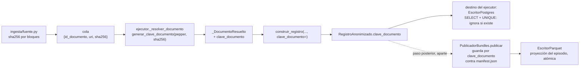

# Diseño: escritura idempotente

## Enfoque técnico

El fallo no es de plomería: falta un dato en el contrato. Se agrega **una identidad de
documento derivada** (`clave_documento`) que nace en la ingesta, cruza la frontera de
`construir_registro` y llega a los dos escritores. Con ese dato en mano la idempotencia se
decide **una sola vez**, en la clave: Postgres obtiene unicidad real anclada al documento, y
el publicador de bundles obtiene una guarda por documento en lugar de una por directorio.

La clave se deriva por HMAC del `sha256` con el pepper, con namespace propio, calcada del
patrón de `pseudonimizacion/claves.py`:

```python
def generar_clave_documento(pepper: bytes, sha256: str) -> str:
    """`clave_documento = HMAC(pepper, "documento|" + sha256)[:16 bytes]` en hex."""
    return _hmac_hex(pepper, f"documento|{sha256.strip().lower()}")
```

El `sha256` crudo NO se publica: publicarlo permitiría a cualquiera con el PDF original
probar pertenencia al corpus.

## Decisiones de arquitectura

### Decisión 1: la identidad viaja en `_DocumentoResuelto`, no en `DocumentoParseado`

**Elección**: `_DocumentoResuelto` (privado de `pipeline/ejecutor.py`) gana el campo
`clave_documento: str`, calculado en `_resolver_documento`, que ya tiene el `ItemLote` con
`item.artefacto.sha256`. `_emitir` la pasa a `construir_registro(..., clave_documento=...)`
como argumento obligatorio de palabra clave, y `RegistroAnonimizado` la transporta.

**Alternativas descartadas**: (a) meterla en `DocumentoParseado` — el parser no conoce la
huella y no debe conocerla; (b) meterla en `ClavesPaciente` — es identidad del documento, no
del paciente; (c) pasar el `ArtefactoCrudo` entero al constructor — rompería el invariante de
que el artefacto no lleva contenido más allá de la extracción.

**Fundamento**: la huella ya está donde hace falta. No cambia el mensaje de cola
(`{id_documento, uri, sha256}` intacto) ni el mecanismo de ingesta.
**Costo**: el parámetro obligatorio toca las tres compuertas de `tests/calibracion/` (una
línea cada una). Es deliberado: un default silencioso reintroduciría el fallo silencioso.

### Decisión 2: en `RegistroAnonimizado` el campo es opcional; en `construir_registro` no

**Elección**: `clave_documento: str | None = None` al final del dataclass;
`construir_registro` la exige.

**Alternativa descartada**: campo obligatorio en el dataclass — obliga a reordenar campos con
default y rompe todas las construcciones directas de fixtures.

**Fundamento**: mismo precedente que `hora_estudio`/`precision_hora`. `None` significa "sin
identidad", coherente con la columna nullable: en SQL los `NULL` no colisionan entre sí, así
que las filas legadas y los fixtures sintéticos simplemente no participan de la unicidad, sin
excepciones ni ramas especiales.

### Decisión 3: la unicidad vive en `estudio`, y las mediciones la heredan por transacción

**Elección**: `estudio.clave_documento` — `String(32)`, nullable, con
`UniqueConstraint("clave_documento", name="uq_estudio_clave_documento")`.
`escribir_registro` hace `SELECT` por `clave_documento` al abrir la transacción; si existe,
retorna sin escribir NADA (ni estudio ni mediciones). La restricción `UNIQUE` queda como
autoridad ante concurrencia: si dos workers cruzan el `SELECT`, el `IntegrityError` del
segundo se captura, se hace rollback y se trata como "ya escrito".

**Alternativas descartadas**: (a) unicidad por fila de medición — imposible en
`resultado_laboratorio`, que es EAV con N filas por documento, y la unicidad quedaría anclada
al analito en vez del documento; (b) `ON CONFLICT DO UPDATE` — el repo ya lo rechazó en
`vinculo_paciente` por pisar en silencio; (c) sólo el `SELECT`, sin `UNIQUE` — deja una
carrera abierta entre workers.

**Fundamento**: `estudio` ya es una fila por documento desde la migración `0006`. Las
mediciones cuelgan de ella por `id_estudio` y se escriben en la misma sesión, así que la
guarda del estudio las cubre a todas sin restricción propia.

### Decisión 4: reencuentro = ignorar, no reemplazar ni fallar

| Semántica | Costo | Veredicto |
|---|---|---|
| **Ignorar** | No refleja mejoras del parser sobre documentos ya escritos | **Elegida** |
| Reemplazar | `DELETE` en cascada de N filas EAV; un reproceso cortado a mitad destruye datos buenos | Rechazada |
| Fallar | Convierte el reintento tras un corte —el caso normal— en error operativo | Rechazada |

**Fundamento**: mismo `sha256` + mismo pepper + mismo código ⇒ mismo registro derivado. No
hay nada que actualizar, y la ausencia de escritura es más barata y más segura.
**Consecuencia explícita**: si mejora el parser y hay que reprocesar documentos ya escritos,
hace falta purgar por `clave_documento` antes de correr, o escribir contra un esquema nuevo.
La clave es de contenido, no de versión de código. Automatizar esa purga queda fuera de
alcance.

### Decisión 5: una sola decisión de idempotencia, tomada en un solo lugar

Parquet **no es un destino del pipeline**. El `destino: DestinoEscritura` del ejecutor es
`EscritorPostgres` en los dos llamadores reales (`scripts/procesar_carpeta.py:71`,
`trabajadores/tareas.py:100`); no hay destino compuesto. `EscritorParquet` lo usa
`salida/publicador_bundles.py::PublicadorBundles`, un paso posterior y aparte que recibe
`Sequence[RegistroAnonimizado]` por episodio y hoy no tiene llamador de producción.

Nadie anexa a Parquet documento por documento durante la corrida. Por lo tanto: **la
idempotencia se decide una sola vez —en la `clave_documento`— y la respetan los dos
escritores**, cada uno con el mecanismo de su medio.

- **Postgres**: unicidad en `estudio.clave_documento` y saltear si existe (decisión 3, sin
  cambios).
- **Publicador**: la escritura de Parquet entra en la guarda, y la guarda pasa a ser **por
  documento** (`clave_documento`) en vez de por directorio de episodio.

#### El estado actual del publicador tiene dos defectos, no uno

```python
if not destino.exists():
    ...crea el manifiesto...                              # protegido por la guarda

for registro in registros:
    self._escritor_parquet.escribir_episodio(registro)    # FUERA de la guarda
```

1. **La guarda por directorio no alcanza.** Un episodio puede republicarse con un documento
   más que antes faltaba: el directorio ya existe, el manifiesto no se toca y queda
   describiendo un bundle que ya no es el que está en disco.
2. **El bucle pierde documentos.** `escribir_episodio` escribe
   `episodios/{id_episodio}.parquet` con `write_table` a temporal y `temporal.replace`, o sea
   **sobrescribe** (así lo fija `tests/salida/test_publicador_bundles.py:36`). Como todos los
   registros comparten `id_episodio`, el bucle pisa el mismo archivo N veces y **sobrevive
   sólo el último**. No es duplicación: es pérdida silenciosa de datos.

#### La forma elegida

| Pieza | Cambio |
|---|---|
| Manifiesto | Gana `documentos: [clave_documento, ...]` ordenado. Es el registro de qué contiene el bundle. |
| Guarda | Se lee el manifiesto existente; los registros cuya `clave_documento` ya figura se descartan. |
| Sin novedades | No se toca nada: ni manifiesto ni Parquet. Retorna el mismo `destino`. |
| Con novedades | Se escribe la **unión** — manifiesto reescrito atómicamente (temporal + `replace`) con `documentos` y `tipos_documento` recalculados, y la proyección Parquet del episodio regenerada con todas las filas, una por documento. |
| `escribir_episodio` | Pasa a recibir `Sequence[RegistroAnonimizado]` y escribir la tabla completa de una vez, conservando el `replace` atómico. |

**Republicar un episodio con un documento más: se reescribe el manifiesto.**
**Alternativas descartadas**: (a) dejarlo desactualizado —un manifiesto que miente es peor que
uno reescrito, y es exactamente el defecto que hay que cerrar; (b) fallar por conflicto —
convierte el caso legítimo (llegó un documento que faltaba) en error operativo, el mismo
razonamiento de la decisión 4; (c) crear un bundle versionado nuevo —multiplica directorios
por una corrección incremental y no hay consumidor que sepa elegir versión.
**Fundamento**: el manifiesto es derivado y chico (un JSON), reescribirlo es atómico y cuesta
nada. La decisión 4 dice "ignorar" para el **mismo** documento; acá el documento es
**distinto**, así que agregarlo es la respuesta correcta y no contradice nada.
**Tradeoff**: `version_pipeline` del manifiesto pasa a ser la de la última publicación que
aportó algo, no la de la primera. Si un episodio se completa en dos corridas con versiones
distintas del pipeline, el manifiesto sólo recuerda la última. Se acepta: rastrear la versión
por documento exige una estructura que hoy no existe.

#### Sobre la columna `clave_documento` en los cuatro schemas: se mantiene

Aunque la deduplicación ahora ocurre **antes** de escribir, la columna sigue haciendo falta:

1. Es la única forma de **reconciliar** el Parquet contra `estudio.clave_documento` en
   Postgres, que es la autoridad. Sin ella, auditar que el derivado coincide con la fuente
   exige re-derivar todo el corpus.
2. `EscritorParquet.escribir` sigue siendo `write_to_dataset`, o sea **anexa**, y hoy no tiene
   llamador de producción. Dejarla sin columna de identidad reintroduce exactamente este
   problema en cuanto alguien la conecte. Se le agrega además una deduplicación por
   `clave_documento` **dentro del lote recibido**: cuesta un `set` en memoria.

**Costo**: una columna de 32 caracteres por fila. Barato contra el precio de no poder auditar.

### Decisión 6: contenido corregido = documento nuevo

**Elección**: si un documento se corrige, su `sha256` cambia, su `clave_documento` cambia y
entra como documento nuevo. Es correcto: es otro contenido.

**Consecuencia para el consumidor**: pueden coexistir dos `estudio` del mismo episodio, tipo y
fecha, uno por versión del papel. El dataset no sabe cuál es la corrección. Desempatar
clínicamente exige una noción de versión de documento que hoy no existe y que este cambio no
introduce. Queda documentado como riesgo aceptado.

## Recorrido de la identidad



El trazo punteado es deliberado: el publicador **no** cuelga del ejecutor. Es un paso
posterior que recibe los registros por episodio, y hoy sólo lo ejercitan los tests.

## Cambios de archivos

| Archivo | Acción | Descripción |
|---|---|---|
| `src/anonimizacion/pseudonimizacion/claves.py` | Modificar | `generar_clave_documento(pepper, sha256)`, namespace `"documento\|"` |
| `src/anonimizacion/dominio/modelos.py` | Modificar | `RegistroAnonimizado.clave_documento: str \| None = None` |
| `src/anonimizacion/salida/constructor_registro.py` | Modificar | Parámetro obligatorio de palabra clave; se propaga tal cual |
| `src/anonimizacion/pipeline/ejecutor.py` | Modificar | Campo en `_DocumentoResuelto`; derivación en `_resolver_documento`; propagación en `_emitir` (línea 424) |
| `src/anonimizacion/salida/modelos_orm.py` | Modificar | Columna + `UniqueConstraint` en `Estudio` |
| `src/anonimizacion/salida/destinos/postgres.py` | Modificar | Guarda de existencia + captura de `IntegrityError` |
| `src/anonimizacion/salida/destinos/parquet.py` | Modificar | `clave_documento` en los 4 `pa.schema` y en las 4 funciones de filas; dedup por lote en `escribir`; `escribir_episodio` pasa a recibir la secuencia y escribir la tabla completa |
| `src/anonimizacion/salida/publicador_bundles.py` | Modificar | `documentos` en el manifiesto; guarda por `clave_documento`; escritura Parquet dentro de la guarda; reescritura atómica del manifiesto ante novedades |
| `migrations/versions/0007_clave_documento.py` | Crear | Ver abajo |

### El arreglo del publicador entra en el alcance

No es scope creep: es el mismo defecto en el otro escritor. `PublicadorBundles` **no tiene
consumidores de producción hoy**, así que corregirlo cuesta cambiar código y tests, nada más.
Hacerlo cuando el dataset analítico ya esté poblado exige, además, migrar datos: reconstruir
manifiestos desde `estudio` y regenerar proyecciones de episodio incompletas, sin ninguna
forma barata de saber cuáles quedaron truncadas por el bucle que sobrescribe. La ventana
para arreglarlo gratis es ahora.

## Migración

Head real verificado: `0006_estudio_y_hora` (`0004` fusionó las ramas `0002`; nada apunta a
`0006`). `down_revision = "0006_estudio_y_hora"`.

`upgrade`: `op.batch_alter_table("estudio")` → `add_column("clave_documento", sa.String(32),
nullable=True)` + `create_unique_constraint("uq_estudio_clave_documento",
["clave_documento"])`. `batch_alter_table` es obligatorio: la suite corre contra SQLite, que
no soporta agregar una restricción con `ALTER TABLE` y necesita recrear la tabla.

Sin relleno hacia atrás, igual que `id_estudio` en `0006`: las filas previas quedan en `NULL`
y no participan de la unicidad.

`downgrade`: quita la restricción y la columna. **Se pierde** la identidad de documento de
todo lo ya escrito y con ella la garantía de idempotencia. Los estudios y las mediciones
sobreviven; volver a aplicar la migración deja esas filas en `NULL`, indistinguibles de las
legadas, así que un reproceso posterior las duplicaría.

## Estrategia de pruebas

| Capa | Qué se prueba | Cómo |
|---|---|---|
| Unitaria | `generar_clave_documento` estable, con namespace propio y distinta del `sha256` | Vectores sintéticos con pepper de prueba |
| Unitaria | El `sha256` crudo no aparece en `RegistroAnonimizado` ni en ninguna fila de salida | Aserción de ausencia sobre el registro serializado |
| Integración | Escribir el mismo registro tres veces deja **una** fila en `estudio` y una en cada tabla de mediciones | SQLite en memoria, calcado del experimento de la exploración |
| Integración | `clave_documento=None` conserva el comportamiento actual (sin garantía) | Fixture sin clave |
| Integración | Republicar el mismo episodio no toca ni el manifiesto ni el Parquet | `PublicadorBundles.publicar` dos veces; comparar `mtime` y contenido |
| Integración | Republicar con un documento más: el manifiesto pasa a listar los dos y la proyección tiene dos filas | Bundle de 1 documento, luego de 2 |
| Integración | Un episodio con 3 documentos conserva **3** filas, no la última (el defecto del bucle) | `pq.read_table` sobre `episodios/{id}.parquet` |
| Integración | `EscritorParquet.escribir` con el mismo registro dos veces en el lote escribe una vez | Dedup por `clave_documento` en memoria |
| Carga | Los oráculos de igualdad estricta **no cambian** | El corpus ya descarta duplicados en ingesta (`documentos_unicos=998`, `duplicados_omitidos=2`), así que los conteos se mantienen. Se agrega un invariante nuevo: `filas en estudio == documentos_aprobados`, y una segunda pasada sobre el mismo plan que no debe incrementar ninguna tabla |
| Calibración | Las tres compuertas siguen pasando | Una línea por compuerta: `clave_documento=generar_clave_documento(pepper, sha256_sintetico)` con una huella inventada de 64 hex; ningún valor real |

## Fuera de alcance

Coordinación al cierre de corrida; cinecoronariografía; cambios en la ingesta; purga
automática al reprocesar tras un cambio de parser; conectar `PublicadorBundles` a un llamador
de producción; versionar el `version_pipeline` por documento dentro del manifiesto.

## Preguntas abiertas

- [ ] Ninguna que bloquee la implementación.
