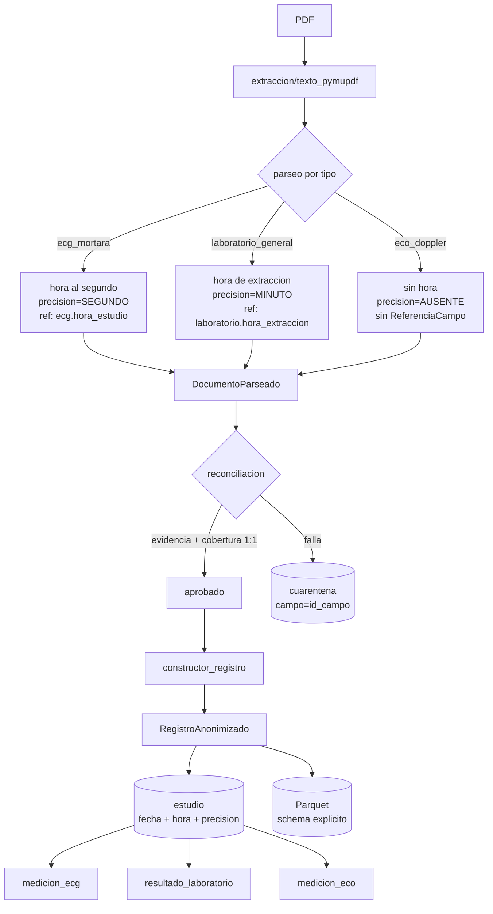

# Diseño: hora del estudio

## Enfoque técnico

Tres piezas, en este orden de dependencia:

1. **Dominio**: `hora_estudio: time | None` + `precision_hora: PrecisionHora` (`AUSENTE | MINUTO | SEGUNDO`) en `DocumentoParseado` y `RegistroAnonimizado`. `fecha_estudio: date` no se toca.
2. **Procedencia**: dos `id_campo` nuevos en la whitelist (`ecg.hora_estudio`, `laboratorio.hora_extraccion`). El eco no recibe ninguno.
3. **Persistencia**: una tabla `estudio` nueva que centraliza `fecha_estudio` + `hora_estudio` por documento, de la que cuelgan las tres tablas de mediciones.

El punto (3) resuelve un defecto anterior a este cambio: **hoy `fecha_estudio` no existe en SQL**. `medicion_ecg`, `resultado_laboratorio` y `medicion_eco` sólo guardan `id_episodio`, y `episodio.fecha_ancla` (`modelos_orm.py:90`) es una ventana de ±7 días con varios estudios adentro. El delta ECG↔laboratorio no es computable en SQL ni siquiera a granularidad de día. Parquet sí lo escribe (`destinos/parquet.py:81`), así que el dato existe en un solo destino de los dos.

## Decisiones de arquitectura

### Decisión 1: una tabla `estudio`, no una columna por tabla de mediciones

| Opción | Tradeoff | Decisión |
|---|---|---|
| Columnas `fecha`/`hora` en cada tabla de mediciones | `resultado_laboratorio` es EAV: N filas por documento, cada una con su copia de la hora. Cualquier escritura parcial produce filas del mismo estudio con horas distintas — inconsistencia **representable** | Rechazada |
| Sólo Parquet; declarar SQL no apto para análisis temporal | Cero migración, pero parte el sistema en dos verdades y contradice la decisión Q1 (Postgres es el sistema de registro) | Rechazada |
| Tabla `estudio` con las mediciones colgando de ella | Migración más ancha y un `INSERT` extra por documento | **Elegida** |

`estudio` guarda una fila por documento publicado: `(id_estudio, id_episodio, tipo_documento, fecha_estudio, hora_estudio, precision_hora)`. Las tres tablas de mediciones ganan un `id_estudio` FK **nullable**. Con esto la hora del laboratorio vive una sola vez por documento y la inconsistencia deja de ser representable; el EAV se normaliza en vez de denormalizarse.

Aditiva por construcción: las filas existentes quedan con `id_estudio` en `NULL`, sin backfill. `id_episodio` se conserva en las tablas de mediciones — no se rompe ninguna query actual.

**Tradeoff aceptado**: `id_estudio` es `Integer` autoincremental, igual que el `id` que ya usan las tres tablas de mediciones. Reprocesar el mismo documento crea una fila `estudio` duplicada — pero eso ya pasa hoy con las mediciones (`escribir_registro` sólo hace `add`, sin la lógica insert-si-no-existe que sí tiene `escribir_episodio`). Este cambio **no empeora ni arregla** esa idempotencia; queda anotada abajo.

### Decisión 2: `Time` sin huso

| Opción | Tradeoff | Decisión |
|---|---|---|
| `Integer` de minutos desde medianoche | Pierde el segundo que el ECG sí trae; ilegible sin decodificar | Rechazada |
| `String` normalizado | Sin aritmética ni orden en SQL sin cast; el delta es justo la variable que motiva el cambio | Rechazada |
| `DateTime` recombinando fecha y hora | Le inventa 00:00 al eco: precisión fabricada, indistinguible de una hora real | Rechazada (ya rechazada en la propuesta) |
| `sa.Time` → `TIME WITHOUT TIME ZONE` | Naive por construcción | **Elegida** |

`TIME WITH TIME ZONE` queda descartado explícitamente: obligaría a declarar un offset que el documento no trae. Naive **es** el modelado correcto de "hora local del instituto, sin huso". Se documenta en el docstring de la tabla, que es donde lo va a leer quien consuma.

### Decisión 3: la ausencia es un valor, no un `NULL`

`precision_hora` es lo que hace explícita la ausencia. `hora_estudio = NULL` acompañado de `precision_hora = 'ausente'` dice "este tipo de documento no la trae", y lo dice sin que el consumidor tenga que saber de antemano qué tipo de documento sí la trae.

No es derivable: un laboratorio a las `08:45` se guarda como `08:45:00`, byte por byte idéntico a un ECG cuyo header dijera `08:45:00`. Sin el marcador, un delta calculado sobre laboratorio reclamaría precisión de segundo que el documento nunca declaró. Por eso `precision_hora` es un campo explícito del dominio y no una función de `hora_estudio`.

**"No la trae" vs. "trae pero no se pudo leer"**: no colapsan porque **viven en tablas distintas**. La cuarentena es terminal — un documento que falla en reconciliación nunca produce un `RegistroAnonimizado`, así que nunca hay fila en `estudio`. El fallo queda en `cuarentena` con `campo = 'laboratorio.hora_extraccion'`. Un `estudio` con `precision_hora = 'ausente'` significa siempre lo primero.

En Parquet: `hora_estudio` como string ISO o `None`, más `precision_hora`. **Gotcha**: `pa.Table.from_pylist` infiere el tipo por lote; un lote de ecos entero deja `hora_estudio` con tipo `null`, y al leer el dataset esa partición choca con las de ECG. Hay que declarar un `pa.schema` explícito en `_escribir_dataset` en vez de seguir infiriendo.

### Decisión 4: procedencia — el 1:1 de cobertura es el riesgo real

`verificar_cobertura` (`inventario.py:25`) exige correspondencia **uno a uno** entre hallazgos del inventario y `ReferenciaCampo` del parseo. Agregar un `id_campo` sin su patrón de inventario correspondiente es `COBERTURA_INCOMPLETA`; agregar un patrón que matchee de más es `COBERTURA_AMBIGUA`.

Dos trampas concretas:

- **ECG**: el patrón de `ecg.fecha_estudio` (`reconciliacion/ecg_mortara.py:21`) ya matchea el timestamp **completo**, fecha y hora. El patrón de `ecg.hora_estudio` MUST anclarse a ese mismo timestamp completo y capturar la porción horaria. Un `\d{2}:\d{2}:\d{2}` suelto matchearía también dentro del patrón de institución (`ecg_mortara.py:94`) → cobertura ambigua.
- **Laboratorio**: `reconciliacion/laboratorio_general.py:208` llama a `reconciliar_referencias` **sin** `validador_asociacion`, así que cae en el camino de `pagina.count(valor) == 1` (`_comun.py:51`). Un `08:45` suelto tiene chance alta de aparecer cero o varias veces en la página → `VALOR_DISCREPANTE` o `EVIDENCIA_AMBIGUA` sobre documentos legítimos. Hay que introducir un `validador_asociacion` anclado al rótulo `Hora de Extracción:`, siguiendo el patrón de `_asociacion_ecg`. **Es la parte más frágil del cambio.**

El eco no declara `id_campo` de hora ni patrón de inventario: sin referencia y sin hallazgo, el 1:1 se sostiene solo.

### Decisión 5: normalización espejo de `normalizar_fecha_iso`

`normalizar_hora_iso(valor) -> str` acepta sólo `%H:%M:%S` y `%H:%M` explícitos y levanta `ValueError` en cualquier otro caso. Mismo contrato que `normalizar_fecha_iso` (`normalizacion.py:30`): convierte formatos declarados, no infiere. El formato de entrada es además lo que determina `precision_hora`.

### Decisión 6: migración `0006`, con `batch_alter_table`

Head real verificado: **`0005_tamano_y_tope_cuarentena`**. Es head único — las dos ramas `0002_` (`metadata_segura_cuarentena` y `corridas_durables`) ya fueron fusionadas por `0004_fusion_corridas_cuarentena`. La revisión nueva es `0006_estudio_y_hora`, con `down_revision = "0005_tamano_y_tope_cuarentena"`.

`upgrade`: crea `estudio` (índice en `id_episodio`) y agrega `id_estudio` nullable + FK a `medicion_ecg`, `resultado_laboratorio` y `medicion_eco`.

**Gotcha**: SQLite no soporta agregar una FK con `ALTER TABLE`, y este repo corre sus tests contra SQLite en memoria. Los tres `add_column` con FK MUST ir dentro de `op.batch_alter_table`. Las migraciones anteriores no lo necesitaron porque ninguna agregó una FK (`0005` agrega dos `Integer` pelados).

`downgrade`: saca las tres columnas (también en `batch`) y dropea `estudio`.

**Qué se pierde al revertir**: toda `fecha_estudio` y `hora_estudio` escrita en SQL, más el agrupamiento por estudio. Como ninguna de las dos existía antes de `0006`, el downgrade devuelve el esquema al status quo previo — pero los datos escritos después del upgrade sólo se recuperan reprocesando el corpus. Atenuante: Parquet conserva ambos campos, así que hay un camino de recuperación que no exige volver a los PDFs.

## Flujo del dato

El eco recorre el camino completo con `precision_hora = AUSENTE`; nunca toma la rama de cuarentena por no traer hora.

## Cambios por archivo

| Archivo | Acción | Descripción |
|---|---|---|
| `dominio/modelos.py` | Modificar | `hora_estudio` + `precision_hora` en ambos dataclasses |
| `dominio/precision_hora.py` | Crear | Enum `PrecisionHora` |
| `dominio/referencias.py` | Modificar | `ecg.hora_estudio`, `laboratorio.hora_extraccion` en la whitelist |
| `parseo/ecg_mortara.py` | Modificar | `_parsear_fecha` deja de truncar; emite hora + referencia |
| `parseo/laboratorio_general.py` | Modificar | `hora_extraccion` sale de `adicionales` a campo tipado |
| `parseo/eco_doppler.py` | Modificar | `precision_hora = AUSENTE` explícito |
| `reconciliacion/normalizacion.py` | Modificar | `normalizar_hora_iso` |
| `reconciliacion/ecg_mortara.py` | Modificar | Patrón de inventario anclado + rama en `_asociacion_ecg` |
| `reconciliacion/laboratorio_general.py` | Modificar | Patrón de inventario + `validador_asociacion` nuevo |
| `salida/modelos_salida.py` | Modificar | Propagación a los payloads de salida |
| `salida/constructor_registro.py` | Modificar | Propaga hora y precisión al registro |
| `salida/modelos_orm.py` | Modificar | Clase `Estudio` + `id_estudio` en las tres tablas |
| `salida/destinos/postgres.py` | Modificar | Inserta `estudio` y enlaza las mediciones |
| `salida/destinos/parquet.py` | Modificar | Columnas nuevas + `pa.schema` explícito |
| `migrations/versions/0006_estudio_y_hora.py` | Crear | Sobre head `0005_tamano_y_tope_cuarentena` |
| `tests/calibracion/` | Modificar | 3 compuertas |
| `tests/carga/` | Modificar | Oráculos de igualdad estricta |

## Estrategia de pruebas

| Capa | Qué | Cómo |
|---|---|---|
| Unidad | `normalizar_hora_iso` rechaza formatos no declarados y no infiere husos | Tabla de casos |
| Unidad | El ECG conserva el segundo | Test que falla si vuelve a truncarse |
| Unidad | El eco emite `AUSENTE` y **nunca** `00:00` | Aserción negativa explícita |
| Reconciliación | Hora anclada a su rótulo; hora presente pero ilegible va a cuarentena | PDFs sintéticos |
| Cobertura | El 1:1 se sostiene con el `id_campo` nuevo | `verificar_cobertura` directo |
| Integración | `NULL` + `AUSENTE` sobreviven hasta ambos destinos | SQLite en memoria + `tmp_path` |
| Migración | `upgrade`/`downgrade` sobre SQLite | Ciclo completo ida y vuelta |
| Carga | 1.000 y 10.000 PDFs | Corrida fresca contra oráculo regenerado |

**Calibración**: las tres compuertas verifican campo por campo contra muestra real y son deliberadamente estrictas. Cada una se actualiza **en el mismo work unit que su parser**, nunca después: ECG y laboratorio ganan la aserción de hora; el eco gana la aserción negativa. Las muestras clínicas no entran al repositorio; las compuertas siguen leyéndolas de su ubicación local de siempre.

**Carga**: los oráculos son de igualdad estricta y el schema de Parquet cambia, así que **rompen por diseño**. Hay que regenerar y volver a correr ambos ensayos. El costo de memoria del campo nuevo es despreciable frente al pico de 301 MiB medido para 10.000 documentos, pero el pico es parte del contrato y se revalida igual.

## Despliegue

Dos work units, en este orden, calcados de la mitigación de la propuesta:

1. Dominio + parseo + reconciliación + Parquet. **Se revierte solo, sin pérdida de datos.**
2. `Estudio` + ORM + migración `0006` + escritor Postgres. Único con costo de datos al revertir.

El orden importa: el work unit 2 depende del campo de dominio del 1. Al revés no compila.

## Preguntas abiertas

- [ ] `escribir_registro` no es idempotente hoy (reprocesar duplica mediciones). `estudio` hereda el problema. ¿Se arregla acá o queda como cambio propio? Recomendación: **queda afuera** — arreglarlo bien exige una identidad de documento estable que hoy no llega a `RegistroAnonimizado`.
- [ ] ¿`id_estudio` debería ser `NOT NULL` en una migración posterior, una vez reprocesado el corpus? Requiere confirmar que no queden filas históricas que preservar.
- [ ] El laboratorio trae además una columna de resultados anteriores con sus propias fechas. La compuerta de calibración debe anclar el rótulo del informe actual; confirmar contra la muestra que el ancla elegida no matchee esa columna.
