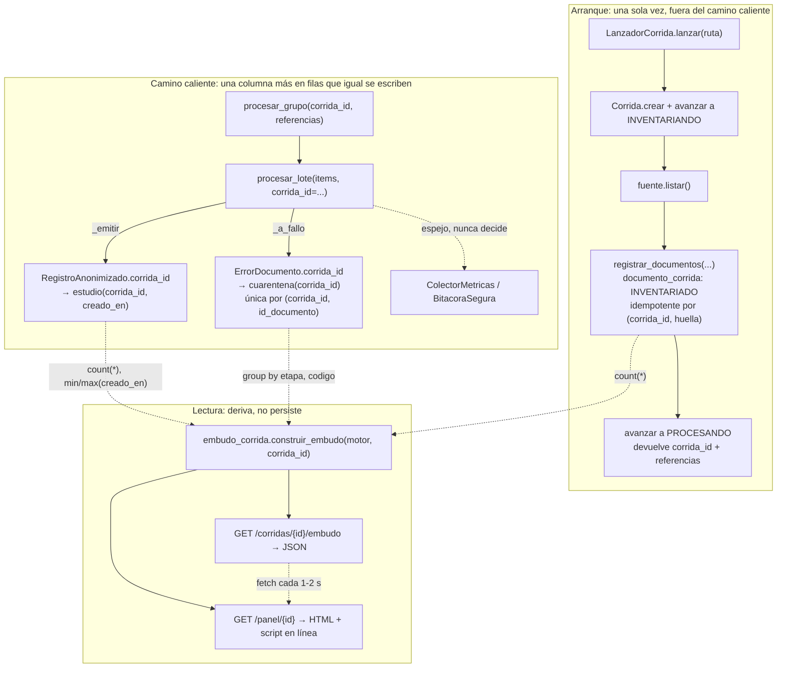

# Diseño: panel de operación

## Enfoque técnico

El panel no mide: **cuenta lo que el pipeline ya escribió**. Para eso hace falta una sola cosa
que hoy no existe —saber qué corrida produjo cada fila— y una sola cosa que hoy falta contar
—cuántos documentos entraron—. Todo lo demás son consultas agregadas sobre índices.

Cuatro piezas, en orden de dependencia:

1. **`corrida_id` viaja como dato**, desde el mensaje de cola hasta `estudio` y `cuarentena`.
   Nunca como dependencia: ningún módulo del núcleo importa `RepositorioCorridas` ni consulta la
   tabla `corrida`.
2. **`cuarentena` gana la unicidad que `estudio` ya tiene**, para que reprocesar no sobrecuente
   caídos.
3. **El inventario de la corrida es el denominador**, escrito una sola vez al arranque en
   `documento_corrida`, sin tocar el vocabulario de estados.
4. **El adaptador web lee, deriva y dibuja**, con el mismo corte que ya existe entre
   `web/reporte_cuarentena.py` (datos) y `web/plantilla_reporte.py` (HTML).

Y una corrección que este cambio arrastra porque el embudo depende de ella: `procesar_lote`
**MUST** devolver exactamente un resultado por ítem de entrada. Hoy eso es cierto por accidente
(ver Decisión 6).

## Decisiones de arquitectura

### Decisión 1: `corrida_id` es un parámetro del lote, no un campo de la referencia

**Elección**: `procesar_grupo(corrida_id: str, referencias: Sequence[Mapping[str, str]])` y
`EjecutorPipeline.procesar_lote(items, *, corrida_id: str | None = None)`.

| Opción | Costo | Veredicto |
|---|---|---|
| **(a) Parámetro hermano del lote** | Una firma más ancha en dos funciones | **Elegida** |
| (b) Cuarta clave en cada referencia | Rompe el centinela de claves exactas de `procesar_grupo` —la barrera que reemplazó a la prueba por construcción de "sin PII en cola"— y repite N veces un valor del lote | Rechazada |
| (c) Campo en `ItemLote` | Mismo problema por otra puerta: `ItemLote` se construye clave por clave desde la referencia, así que el campo invita a la cuarta clave | Rechazada |
| (d) Parámetro de `__init__` / de la fábrica | Obliga a `FabricaEjecutor = Callable[[], EjecutorPipeline]` a recibir argumentos, y mete estado por-mensaje en una raíz de composición que se arma una vez por worker | Rechazada |

**Por qué NO viola "sin PII en cola"**: esa disciplina restringe *qué* transporta el mensaje, no
cuántos parámetros tiene. `corrida_id` es un UUID administrativo generado por el lanzador; no se
deriva de ningún contenido ni de ninguna ruta. Y la (a) **refuerza** el centinela en vez de
debilitarlo: la referencia por documento sigue teniendo exactamente `{id_documento, uri, sha256}`,
y el test que falla ante una clave extra queda intacto.

**Aislamiento de fallo por documento**: `corrida_id` no participa de ninguna decisión del pipeline.
Se copia a `RegistroAnonimizado.corrida_id` en `_emitir` y a `ErrorDocumento.corrida_id` en
`_a_fallo`, y ahí termina. No hay ninguna rama nueva que pueda fallar por documento.

### Decisión 2: el dato viaja en el registro y en el error, no en la firma de los puertos

**Elección**: `RegistroAnonimizado` y `ErrorDocumento` ganan `corrida_id: str | None = None`.
`DestinoEscritura` y `DestinoCuarentena` **no cambian de firma**.

**Fundamento**: `EscritorCuarentena` declara en su docstring que es "deliberadamente angosta: no
acepta nada más que un `ErrorDocumento`, así que no hay forma de que se filtre PII por este camino
aunque quien lo llame lo intente". Ensanchar `registrar(error, *, corrida_id)` rompería esa
propiedad justo en el módulo que la publica. Meter el dato en el `ErrorDocumento` la conserva: el
tipo sigue siendo la única superficie, y sigue estando cerrado.

Los dos son **registros de trazabilidad**, no modelos clínicos: `ErrorDocumento` ya lleva `etapa`,
`pagina`, `tamano_bytes`; `RegistroAnonimizado` ya lleva `clave_documento` e `id_episodio`.
`corrida_id` es de la misma clase —dice bajo qué ejecución se produjo la fila— y es opaco.

**Precedente reusado**: `clave_documento` (spec `escritura-idempotente`, Decisión 2). Campo
opcional al final del dataclass, columna nullable, sin relleno hacia atrás.

### Decisión 3: `corrida_id` va sólo a `estudio` y a `cuarentena`

Corrige el alcance de la propuesta, que también nombraba `episodio` y las tablas de medición.

| Tabla | Veredicto | Por qué |
|---|---|---|
| `estudio` | **Sí** | Una fila por documento publicado, con clave única. Es el contador de "llegó a salida" |
| `cuarentena` | **Sí** | Es el contador de "se cayó", y el que necesita la unicidad |
| `episodio` | **No** | Una fila por GRUPO, y un episodio puede completarse en dos corridas (llega el estudio que faltaba). `escribir_episodio` es idempotente por existencia, así que la segunda corrida no pisaría nada: la fila quedaría atribuida para siempre a la primera. Atribuir un episodio a una corrida es **falso** en el caso que este proyecto ya sabe que ocurre |
| `medicion_ecg`, `resultado_laboratorio`, `medicion_eco` | **No** | Cuelgan de `estudio.id_estudio`. `JOIN estudio` da la atribución exacta y gratis; la columna costaría tres columnas y una escritura de índice por fila de medición para no agregar información |
| `texto_seccion_eco` | **No** | Ídem, y encima cuelga de `id_episodio` |

Esto recorta la migración a dos tablas y saca del cambio el 60 % de la superficie de esquema que
la propuesta anticipaba.

**Conflicto declarado con la especificación**: el Requisito 1 de `trazabilidad-por-corrida` exige
`corrida_id` también en `episodio` y en las tablas de medición. Este diseño lo contradice a
propósito y con evidencia —un episodio completado en dos corridas quedaría atribuido a la primera,
y `escribir_episodio` es idempotente por existencia, así que la segunda no lo corregiría—. No se
resuelve por decisión de este agente: queda como pregunta abierta para reconciliar la
especificación antes de `sdd-tasks`.

### Decisión 4: la clave de idempotencia de cuarentena es `(corrida_id, id_documento)`

| Opción | Qué permite | Qué rompe | Veredicto |
|---|---|---|---|
| **`(corrida_id, id_documento)`** | Una corrida registra un desenlace por documento; dos corridas registran dos —eso es historial | Nada verificable | **Elegida** |
| `(corrida_id, id_documento, etapa, codigo)` | Dos filas del mismo documento en la misma corrida con códigos distintos | El embudo: `apartados` dejaría de ser `COUNT(*)`. Y acomoda en silencio una situación que hoy es imposible por construcción y que, si apareciera, es un bug que queremos ver | Rechazada |
| `(id_documento)` global | — | Borra el historial entre corridas, y falla al crearse si ya hay duplicados de corridas viejas | Rechazada |

**¿Puede un documento producir más de una fila en la misma corrida?** No, y está verificado sobre
`procesar_lote`: cada ítem toma exactamente una de tres puertas —`_resolver_documento` lanza →
`_a_fallo`; resuelve y la coordinación lo aparta → `_a_fallo`; resuelve, se aprueba y `_emitir`
lanza → `_a_fallo`—. Un documento apartado por la coordinación no está en
`id_episodio_por_documento`, así que no llega a `_emitir`. El cuarto productor,
`FuenteLocal._apartar_por_sobretamaño`, nunca entra a `procesar_lote` y usa otro espacio de
identificadores (sha256 de la ruta). La restricción no es una red de seguridad contra el pipeline:
es la red contra el **reintento de Celery sobre el mismo grupo**, que hoy duplica.

**Guarda de dos capas en `EscritorCuarentena.registrar`**, calcada de
`salida/destinos/postgres.py::escribir_registro`:

```python
with Session(self._engine) as sesion:
    try:
        with sesion.begin():                      # consulta e inserción en LA MISMA transacción
            if self._ya_registrado(sesion, error): # evita el trabajo en el caso normal
                return
            sesion.add(Cuarentena(...))
    except IntegrityError:
        pass                                       # la restricción única es la autoridad final
```

**Por qué las dos capas y no sólo el `IntegrityError`**: `_a_fallo` envuelve `registrar` en un
`except Exception: pass`. Si la duplicación se manifestara como excepción propagada, sería
**indistinguible de una caída real de infraestructura** —el caso que alimenta la columna "sin
desenlace"—. Resolverla dentro del escritor mantiene esa columna significando lo que dice.

**Qué pasa con `corrida_id IS NULL`** (filas viejas, el script sin corrida, los tests): `NULL` no
colisiona con `NULL` en una restricción única, ni en SQLite ni en Postgres. Consecuencia explícita
y simétrica a `estudio.clave_documento`: **sin corrida no hay garantía de idempotencia**. Y
consecuencia operativa: la migración crea la restricción sobre una tabla con duplicados
preexistentes **sin necesidad de deduplicar ni rellenar nada**.

### Decisión 5: `documento_corrida` se usa como inventario y nada más

**Elección**: una escritura por documento al arranque, con
`estado = EstadoDocumentoCorrida.INVENTARIADO.value`, que **nunca avanza** en este cambio.

| Alternativa | Costo | Veredicto |
|---|---|---|
| **Inventario en `documento_corrida`** | N inserciones una sola vez, fuera del camino caliente | **Elegida** |
| Contador `corrida.total_documentos` | Una escritura en vez de N, pero es un denominador denormalizado que puede derivar de la realidad, no dice QUÉ documentos entraron, y no es idempotente ante un relanzamiento | Rechazada |
| Sin denominador (sólo publicados + apartados) | Gratis | Rechazada: sin "entraron" no hay embudo, ni porcentaje, ni tiempo restante |

Lo decisivo de la elegida es gratis: `uq_documento_corrida_huella (corrida_id, huella_contenido)`
ya existe, así que **relanzar la misma corrida no duplica el denominador**.

#### La línea exacta contra la máquina de estados

**Lo que se toca**: `RepositorioCorridas` gana `registrar_documentos(documentos, *,
tamano_lote=1000) -> int` —la versión por lote de `registrar_documento`, con la misma guarda de dos
capas—. Motivo medido: `registrar_documento` abre una `Session` y una transacción por documento;
100.000 transacciones sueltas son minutos de arranque para un trabajo que en una sesión por millar
son segundos. `registrar_documento` se conserva sin cambios y sus tests también.

**Lo que NO se toca, y queda escrito**: `DocumentoCorrida.avanzar_a`, `_TRANSICIONES_DOCUMENTO`,
`actualizar_documento` con su bloqueo optimista, `documentos_para_reanudar`,
`procesar_extraccion_minima`, `procesar_extraccion_completa`, y el enum
`EstadoDocumentoCorrida` completo.

**Y la regla que lo fija**: el panel **MUST NOT** leer `documento_corrida.estado`. Leerlo mostraría
100 % `inventariado` para siempre —exactamente el avance falso que la propuesta rechaza—. El
centinela es conductual, no un grep: un test inventaría documentos, publica algunos y aparta otros,
y afirma que el embudo da los números correctos **mientras todas las filas de `documento_corrida`
siguen en `inventariado`**. Si alguien acopla el embudo al estado, ese test se pone rojo.

Del lado de la corrida, `EstadoCorrida` se usa sólo para las tres transiciones que corresponden a
algo que realmente ocurre: `CREADA → INVENTARIANDO → PROCESANDO`. El cierre **no** se modela: para
llegar a `COMPLETADA` la tabla de transiciones obliga a pasar por `RECONCILIANDO` y `PUBLICANDO`,
dos fases que el camino real no ejecuta. **El panel deriva la marcha de la evidencia, no del
estado** (ver Decisión 8).

#### El denominador no es el inventario: es el inventario **más** el sobretamaño

Un artefacto que supera el tope se aparta dentro de `FuenteLocal._listar_generador` **antes** de
calcular su huella (`ingesta/fuente.py:163-166`): su contenido nunca se lee. Por lo tanto
**no puede inventariarse** —`documento_corrida.huella_contenido` exige el sha256 del contenido—.
Eso no es una preferencia de diseño, es una imposibilidad, y define el denominador:

```
entraron = inventariados + apartados_en_ingesta_de_esta_corrida
```

Para que esos apartados sean atribuibles sin meterle estado de corrida a `FuenteLocal` —que es un
dataclass frozen construido una vez por worker—, el lanzador arma la fuente de enumeración con un
sumidero decorado:

```python
@dataclass(frozen=True)
class CuarentenaDeCorrida:
    """Estampa la corrida en cada error antes de delegar.

    Existe porque la ingesta aparta artefactos que nunca llegan al ejecutor, y por
    lo tanto nunca pasan por el único punto donde el `corrida_id` está en mano.
    """
    interna: SumideroCuarentena
    corrida_id: str

    def registrar(self, error: ErrorDocumento) -> None:
        self.interna.registrar(replace(error, corrida_id=self.corrida_id))
```

Con esto la barra de `ingesta` del embudo es real y no una barra estructuralmente en cero —lo que
el Requisito 2 de la especificación condena para `deteccion`—, y la exclusión del sobretamaño del
throughput (Requisito 4) sale de una condición de una línea sobre la serie temporal, no de una
excepción a mano.

#### Privacidad: `documento_corrida` NO es una tabla sin PII por diseño

`ruta_autorizada` guarda la ruta completa, y este proyecto ya asume que **el nombre de carpeta
puede ser PII** (`ingesta/fuente.py:174-178` hashea la ruta por ese motivo). El panel lee de esta
tabla **un único número** —`count(*)`— y nunca proyecta `ruta_autorizada` ni `huella_contenido`.
Queda asentado como restricción del modelo de lectura, no como confianza en el llamador.

### Decisión 6: `procesar_lote` devuelve un resultado por ítem, y eso se verifica

`ejecutor.py:366` pasa `corrida_cerrada=True` fijo. Verificado contra
`coordinador_episodios.py:80`: `episodios_pendientes` sólo se puebla cuando `corrida_cerrada` es
`False` **y** el motivo es `ESTUDIOS_FALTANTES`. Con `True` está siempre vacío, y por eso
`resueltos_aprobados ∪ fallos` cubre hoy todos los resueltos. Con `False`, los pendientes no
entran en ninguno de los dos: desaparecen del valor de retorno y el embudo los contaría en el
residuo para siempre.

**Elección**: la constante se queda, pero deja de ser anónima, y la invariante se hace explícita.

```python
# El grupo ES la unidad completa de trabajo: no hay un lote posterior de esta
# misma corrida que pueda traer el estudio faltante, así que no hay nada que
# dejar pendiente. Con `False` la coordinación devolvería episodios pendientes
# que `_coordinar_resueltos` no sabe contabilizar -- ver el centinela.
_GRUPO_ES_UNIDAD_COMPLETA = True
```

y `_coordinar_resueltos` **falla ruidoso** (`RuntimeError`) si algún resuelto no cae ni en
aprobados ni en cuarentena.

| Opción ante un pendiente | Veredicto |
|---|---|
| **Fallar ruidoso** | **Elegida**: no es un fallo del documento, es una configuración cuya contabilidad no existe. Un `RuntimeError` en el worker es infinitamente mejor que un documento que se evapora del embudo |
| Mandarlo a cuarentena | Rechazada: mentiría sobre el desenlace. Un pendiente no está apartado |
| Devolverlo con un estado nuevo | Rechazada: es media reanudación, que está fuera de alcance |

**El centinela** (`tests/pipeline/test_partición_total_del_lote.py`): inyecta un
`coordinar_episodios` falso que devuelve un episodio en `episodios_pendientes`, corre
`procesar_lote` y afirma `len(resultados) == len(items)`. **Hoy ese test es rojo** —los pendientes
se pierden en silencio—, así que es TDD real y no una foto del comportamiento actual. Un segundo
test afirma que el caso normal también cumple la igualdad. `corrida_cerrada` **no** se convierte
en parámetro: exponerla sin la contabilidad detrás es ofrecer la trampa con una perilla.

### Decisión 7: el centinela de observabilidad ejercita la raíz de composición, no un doble

`construir_fabrica_ejecutor` gana `metricas: ColectorMetricas | None = None` y
`bitacora: BitacoraSegura | None = None`, con la misma semántica que `dormir` y `resolver_claves`:
`None` significa "usar el valor de producción", no "desactivar".

Tres tests, y hacen falta los tres:

| Test | Qué rompe si se quita el cableado |
|---|---|
| `test_la_fabrica_cablea_la_observabilidad` | Espía inyectado por la fábrica + un grupo real de tres PDFs por `tareas.procesar_grupo` (mismo molde que `tests/integracion/test_wiring_produccion.py`). Si alguien borra `metricas=metricas` dentro de `_fabrica()`, el espía queda vacío → rojo |
| `test_sin_inyeccion_explicita_igual_hay_colector` | Introspección del ejecutor construido SIN pasar nada, como `test_fabrica_inyecta_coordinador`. Cubre el agujero del anterior: conservar el punto de inyección y borrar el default dejaría producción ciega con el primer test en verde |
| `test_un_colector_que_explota_no_tumba_el_grupo` | Colector que lanza en todos sus métodos: los tres documentos se publican igual. Fija la invariante 3 de la propuesta |

**Por qué no un test de código fuente**: `tests/carga/test_cableado_del_banco.py` usa
`inspect.getsource` porque afirma algo *sobre la forma del código* ("el banco no instancia
`EjecutorPipeline`"). Acá la afirmación es *sobre la conducta* ("las observaciones llegan"), y
tiene un camino real para ejercitarla. Un grep no sabría que el colector se cableó pero nunca se
llama.

**Puntos de llamada**, todos envueltos en un `_observar_sin_romper` que traga la excepción del
colector (invariante 3): `incrementar_documento_procesado` en `_emitir`; `incrementar_fallo` en
`_a_fallo`; `observar_duracion_ms` desde `_ejecutar_con_reintentos`, que gana un parámetro
`observar: Callable[[str, float], None] | None = None`; y una llamada a
`bitacora.registrar(resultado.resumen_trazable())` por resultado al cerrar `procesar_lote` —un solo
punto, y pasa por la lista blanca por construcción.

**Regla que este cambio deja asentada**: ninguna pieza de observabilidad se declara terminada sin
un test que la ejercite **por la raíz de composición de producción**.

### Decisión 8: el embudo se calcula sobre los documentos que ya tienen desenlace

Corrige la redacción de la propuesta ("cuántos documentos pasaron cada etapa"). Contar eso sobre
*todos* los inventariados es imposible sin persistir la posición por documento, que es exactamente
la vía que la propuesta rechazó por ~900.000 `UPDATE`.

Lo que sí es exacto:

```
con_desenlace          = publicados + apartados
llegaron_a(etapa k)    = con_desenlace − Σ apartados en etapas anteriores a k
residuo                = entraron − con_desenlace        # con signo, ver Decisión 9
```

`llegaron_a` es exacto por definición sobre `con_desenlace`, y el residuo se muestra aparte, nunca
repartido.

**El residuo tiene una etiqueta, no varias columnas inventadas**: no hay forma de distinguir "en
vuelo" de "perdido" sin un dato que no existe. Se rotula según la evidencia:

| Situación | Rótulo |
|---|---|
| Residuo > 0 y hay documentos terminados en los últimos minutos | *"en vuelo"* |
| Residuo > 0 y sin actividad reciente, corrida activa | *"detenida o en pausa: N sin desenlace registrado"* |
| Residuo > 0 y corrida en estado terminal | *"sin desenlace registrado"* (el `desconocido` de la spec) |
| Residuo = 0 | *"todos los documentos tienen desenlace"* |
| **Residuo < 0** | *"descuadre: N documentos con más de un desenlace"* — ver Decisión 9 |

**El orden de las etapas se declara a mano**, no se deriva del enum: `Etapa` declara
`COORDINACION` entre `RECONCILIACION` y `DETECCION_PII`, y el orden de ejecución real es
`... reconciliacion → deteccion_pii → pseudonimizacion → coordinacion → salida`
(`_resolver_documento` termina en pseudonimización y recién después corre `_coordinar_resueltos`).
`deteccion` y `deteccion_pii` quedan **fuera** de la lista, no en cero: el detector es puro y no
lanza (`ejecutor.py:295`), el tipo desconocido se registra como `parseo`
(`parseo/registro.py:36`) y la clasificación de PII no lanza. Siete etapas, no nueve
(Requisito 2).

### Decisión 9: la invariante de cierre sólo tiene dientes si se verifica el solapamiento

**El problema, dicho sin vueltas**: `desconocido` (y `en vuelo`, que es el mismo número mientras la
corrida sigue activa) está definido como **resto**. Si la última categoría es la diferencia,
`publicados + apartados + en_vuelo + desconocidos == inventariados` es una **tautología**: cierra
porque se despejó para que cierre. El Requisito 1 de `panel-de-operacion` quedaría cumplido por
construcción y su segundo escenario —"un descuadre se declara, no se disimula"— sería
**inalcanzable**: para escribir su test habría que fabricar a mano un estado inconsistente, que es
la definición de un test sin valor.

**El descuadre no es por defecto: es por exceso.** El residuo da NEGATIVO cuando un documento se
cuenta en más de una categoría. Dos vías, las dos verificadas en el código:

| Vía de solapamiento | Estado |
|---|---|
| Dos filas de `cuarentena` para el mismo documento (reintento de Celery sobre el grupo; hoy no hay ninguna restricción única, `modelos_orm.py:229-241`) | **La cierra la Decisión 4** |
| Un documento con fila en **ambos** destinos | **Queda abierta, y es la que da dientes a la invariante** |

La segunda es alcanzable hoy, por un camino real: en `_emitir`, `escribir_registro` commitea; la
conexión se cae antes de que el cliente vea el OK; `_ejecutar_con_reintentos` reintenta. El
reintento no duplica `estudio` —`uq_estudio_clave_documento` lo cubre—, pero si los reintentos se
**agotan**, el resultado es `ErrorParseo(ERROR_TRANSITORIO_AGOTADO)` → `_a_fallo` → fila de
cuarentena, **con la fila de `estudio` ya commiteada**. Ninguna restricción cubre eso: la
duplicación *dentro* de un destino está resuelta, el solapamiento *entre* destinos no.

**No se puede detectar con un `JOIN`, y no se va a forzar uno.** No existe clave de unión entre
`estudio` y `cuarentena`: `cuarentena.id_documento` es el identificador de cola, y `estudio` sólo
tiene `clave_documento` = HMAC(pepper, sha256). Agregarle `id_documento` a `estudio` está
**prohibido**: en el camino real ese identificador **es el sha256 crudo**
(`scripts/procesar_carpeta.py:105` construye `ItemLote(id_documento=a.sha256, ...)`), y publicar la
huella cruda es exactamente lo que `escritura-idempotente` prohíbe —permitiría a cualquiera con el
PDF original probar pertenencia al corpus—. El solapamiento se detecta **por aritmética**.

**Elección**: el residuo se calcula y se expone **con signo**. Nunca `max(0, …)`.

| Opción | Veredicto |
|---|---|
| **Residuo con signo + `cierra: bool`** | **Elegida**: el número negativo es la única señal disponible de doble conteo |
| `max(0, residuo)` | Rechazada: convierte el doble conteo en un cero prolijo. Es el silencio exacto que este proyecto viene cerrando, y anularía el Requisito 1 |
| Categoría "duplicados" con su propio conteo | Rechazada: no se puede medir sin la clave de unión que no existe. Sería un número inventado |

En el panel, un residuo negativo no es un número más: es una ficha propia en la paleta de estado,
con símbolo y etiqueta —*"Descuadre: N documentos con más de un desenlace"*— y su explicación
—*"hay documentos con más de un desenlace registrado: un reprocesamiento duplicado, o una
escritura de salida que quedó a medias"*—.

**El centinela verifica solapamiento, no faltante.** Un destino falso que commitea el `estudio` y
después agota reintentos produce el solapamiento por el camino real; el test afirma que el embudo
reporta `residuo < 0` y `cierra == False`, y un segundo test afirma que la pantalla **dibuja el
descuadre** en vez de un cero. Ambos son alcanzables sin fabricar a mano ningún estado
inconsistente.

**Y queda asentado**: la invariante de cierre tiene contenido **sólo si** `desconocido` se define
como resto **y** se verifica que las categorías medidas no se solapan. Sin la segunda mitad es una
tautología disfrazada de invariante.

### Decisión 10: sin framework, y el disparador queda escrito

WSGI crudo + HTML servido + `fetch`/`setInterval` cada 1-2 s. Cero dependencias nuevas.

**Fundamento medido, no ideológico**: SSE sobre WSGI síncrono clava un worker por conexión durante
las ocho a diez horas de la corrida; con cinco espectadores eso agota el pool. FastAPI obliga a
rutas `def` síncronas de todos modos —SQLAlchemy síncrono bloquea el event loop— y queda como
Flask con un runtime de más. Un SPA exige Node, que no existe en la máquina del instituto.
Con 1-5 espectadores el polling son 2,5-5 solicitudes por segundo contra un índice.

**Disparador explícito para revisarlo**: más de ~6 rutas o el primer formulario real → Flask
síncrono. Este cambio deja el total en cinco rutas.

## Recorrido



## Consultas del panel

Tres consultas por refresco, todas agregadas, ninguna trae filas al proceso.

```sql
-- (1) denominador. Recorrido sólo de índice sobre uq_documento_corrida_huella.
SELECT count(*) FROM documento_corrida WHERE corrida_id = :c;

-- (2) publicados + ventanas de tiempo. Recorrido sólo de índice sobre
--     ix_estudio_corrida_creado (corrida_id, creado_en): count, min y max salen
--     del mismo rango contiguo, y el filtro de ventana es un corte del mismo rango.
SELECT count(*)                                            AS publicados,
       min(creado_en)                                      AS primero,
       max(creado_en)                                      AS ultimo,
       sum(CASE WHEN creado_en >= :desde THEN 1 ELSE 0 END) AS en_ventana
FROM estudio WHERE corrida_id = :c;

-- (3) pérdidas por etapa y código, más las mismas ventanas de tiempo. `count(*)`
--     es correcto y NO hace falta DISTINCT: la restricción única
--     (corrida_id, id_documento) lo garantiza -- ése es su segundo pago.
SELECT etapa, codigo, count(*) AS caidos,
       min(creado_en) AS primero, max(creado_en) AS ultimo,
       sum(CASE WHEN creado_en >= :desde THEN 1 ELSE 0 END) AS en_ventana
FROM cuarentena WHERE corrida_id = :c GROUP BY etapa, codigo;
```

El agregado de (3) viene abierto por código a propósito: el embudo usa todas las filas, y la serie
temporal del throughput **descarta la fila `artefacto_sobretamano`** (Requisito 4: ese documento
nunca se leyó, así que no consumió trabajo). Es un filtro sobre un agregado que ya está en memoria,
no una consulta más.

La consulta (3) sobre `cuarentena` se ordena por `ix_cuarentena_corrida_creado`, y su cardinalidad
es la de los caídos —cientos, no cientos de miles—.

**Plan de acceso a 100.000 documentos y 1-2 s**: lo caro es (2), un recorrido de ~100.000 entradas
de índice. En Postgres eso son decenas de milisegundos si el mapa de visibilidad está caliente, y
se degrada mientras la corrida escribe fuerte. **Mitigación: el modelo de lectura memoiza el
embudo por `corrida_id` con vencimiento de un segundo.** Cinco espectadores pasan a costar lo
mismo que uno, y el número más viejo que puede ver el operador tiene un segundo. Esto es lo que
hace que la frecuencia de refresco sea una decisión de pantalla y no de base.

### Rango de tiempo restante

`terminados = publicados + apartados − apartados_por_sobretamaño`. Las dos cotas usan la misma serie
(`estudio.creado_en` ∪ `cuarentena.creado_en`, ambas indexadas junto a `corrida_id`):

| Cota | Fórmula | Por qué |
|---|---|---|
| **Optimista** | `terminados_en_ventana / V`, con `V = 5 min` | Excluye los huecos de inactividad **por construcción**: una pausa saca la ventana, no la diluye |
| **Pesimista** | `terminados / (ultimo − primero)` | Es el promedio contra tiempo de pared, huecos incluidos. Que subestime el throughput es precisamente lo que se le pide a una cota pesimista |

`restante = entraron − terminados`; se muestra el intervalo
`[restante / tasa_optimista, restante / tasa_pesimista]`, siempre como rango.

**Los bordes, todos explícitos y sin división por cero**:

| Caso | Qué se muestra |
|---|---|
| `entraron == 0` (corrida recién creada) | Todas las etapas en cero y la estimación en **"midiendo"** (Requisito 5). Ningún porcentaje, ninguna división |
| `terminados < 200` | "Midiendo". El costo por documento no es uniforme entre ECG, laboratorio y eco: proyectar temprano miente |
| `ultimo == primero` | Cubierto por el caso anterior: no se llega ahí con 200 documentos terminados |
| ventana reciente vacía | "Sin avance en los últimos 5 minutos". No se estima: no hay evidencia de avance que extrapolar |
| `restante == 0` | "Todos los documentos tienen desenlace" |
| `restante < 0` | **"Descuadre"** (Decisión 9). No se estima: el denominador es mentira |

## Esquema y migración

`migrations/versions/0008_corrida_en_salida.py`, `down_revision = "0007_clave_documento"` (head
verificado: nada apunta a `0007`).

| Cambio | Forma | Filas existentes |
|---|---|---|
| `estudio.corrida_id` | `String(36)`, nullable, **sin FK** | `NULL`, sin relleno |
| `estudio.creado_en` | `DateTime(timezone=True)`, nullable, default de Python `_ahora_utc` | `NULL` = "no se sabe cuándo", que es la verdad. Un `server_default` las dataría con el momento de la migración: una mentira |
| `ix_estudio_corrida_creado` | índice `(corrida_id, creado_en)` | — |
| `cuarentena.corrida_id` | `String(36)`, nullable, **sin FK** | `NULL` |
| `uq_cuarentena_corrida_documento` | única `(corrida_id, id_documento)` | Los `NULL` no colisionan: **la restricción se crea sobre duplicados preexistentes sin deduplicar ni rellenar** |
| `ix_cuarentena_corrida_creado` | índice `(corrida_id, creado_en)` | — |
| `ix_documento_corrida_corrida_id` | **se elimina** | Ver abajo |

**`op.batch_alter_table` es obligatorio para `cuarentena`**: SQLite no soporta agregar una
restricción `UNIQUE` con `ALTER TABLE` y la suite corre contra SQLite. Se usa también en `estudio`
por coherencia con `0007`, aunque agregar columnas nullable ahí no lo exigiría.

**Sin claves foráneas hacia `corrida`, deliberadamente.** La tabla `corrida` es plano de control;
`estudio` y `cuarentena` son plano de datos. Una FK haría que la fila administrativa de la corrida
sea requisito para escribir salida clínica: el script sin corrida, los tests y —sobre todo— la
cuarentena que `FuenteLocal` escribe por sobretamaño **antes de que exista ninguna corrida**
fallarían una escritura que no tiene nada malo. El valor de integridad referencial sobre un
identificador operativo no paga ese acoplamiento.

**Los dos índices de una columna de `documento_corrida`, revisados de verdad**:

| Índice | Consulta que sirve hoy | Veredicto |
|---|---|---|
| `uq_documento_corrida_huella (corrida_id, huella_contenido)` | idempotencia del inventario **y** `WHERE corrida_id = ?` por prefijo | Se conserva. Ya cubre el denominador con recorrido sólo de índice |
| `ix_documento_corrida_corrida_id` | ninguna que la única no cubra: mismo prefijo | **Se elimina**. Es un índice estrictamente redundante que se paga en cada una de las 100.000 inserciones del inventario |
| `ix_documento_corrida_estado` | ninguna (`documentos_para_reanudar` filtra el estado en Python) | Se conserva sin tocar: es inútil hoy, pero eliminarlo es una decisión del cambio que mueva los estados |

**El índice compuesto `(corrida_id, estado)` NO entra en este cambio**, y esto corrige la propuesta.
Mientras la máquina de estados esté fuera de alcance, `estado` vale `inventariado` en el 100 % de
las filas: un índice compuesto cuya segunda columna tiene cardinalidad uno no discrimina nada, y el
prefijo `corrida_id` ya lo aporta la restricción única. Se crea cuando el estado se mueva —es
decir, junto al cambio que hoy está fuera de alcance—.

**`downgrade`**: quita índices, restricción y columnas. Se pierde la atribución por corrida de todo
lo ya escrito y con ella la idempotencia de cuarentena; no se pierde ningún dato clínico.

## Estructura del adaptador web

Respeta el corte que ya existe: modelo de lectura sin HTML, render sin dependencias.

| Archivo | Acción | Descripción |
|---|---|---|
| `src/anonimizacion/web/embudo_corrida.py` | Crear | Modelo de lectura. Dataclasses frozen (`Embudo`, `PerdidaEtapa`, `Estimacion`), las tres consultas, la memoización de un segundo y las reglas de borde. **Nunca proyecta `ruta_autorizada` ni `huella_contenido`**, y no lee `documento_corrida.estado` |
| `src/anonimizacion/web/plantilla_panel.py` | Crear | HTML por f-strings, CSS en línea, modo oscuro con la misma paleta de `plantilla_reporte.py`, todo escapado, más el `<script>` de polling en línea |
| `src/anonimizacion/web/servicio_corridas.py` | Crear | Implementación real de `ServicioCorridas` |
| `src/anonimizacion/web/rutas_corridas.py` | Modificar | Dos rutas nuevas; ver la nota de orden |
| `src/anonimizacion/ingesta/lanzador_corrida.py` | Crear | `LanzadorCorrida`: crea la corrida, inventaría por el puerto de ingesta y devuelve `corrida_id` + referencias. Único punto donde nace una corrida |
| `scripts/servir_panel.py` | Crear | Punto de entrada WSGI |

### Las rutas

| Ruta | Devuelve |
|---|---|
| `GET /panel/{id_corrida}` | La página. Primer pintado servido, ya con números |
| `GET /corridas/{id_corrida}/embudo` | El JSON que consume el polling |

**Orden de despacho, o el 404 asegurado**: `rutas_corridas.py:52` matchea
`metodo == "GET" and ruta.startswith("/corridas/")`, y `_consultar_corrida` rechaza cualquier
identificador que contenga `/` (líneas 82-83). `/corridas/{id}/embudo` **es un GET**, así que cae
en esa rama y responde 404 salvo que su comprobación se evalúe **antes**. Es lo único que hay que
cuidar acá.

El precedente de `/reintentar` (línea 54) **no** es un caso análogo y no se toca: está guardado por
`metodo == "POST"`, la rama genérica de la 52 exige `GET`, así que un POST sigue de largo y llega a
la suya. La ruta funciona hoy. Que un GET a esa misma ruta dé 404 es correcto y deliberado.
Reordenar ramas de despacho que ya están bien es riesgo puro a cambio de nada.

### El contrato JSON

```json
{
  "corrida_id": "…", "estado": "procesando", "generado_en": "2026-09-05T13:04:11Z",
  "entraron": 100000, "publicados": 41230, "apartados": 318,
  "residuo": 58452, "cierra": true,
  "marcha": "en_vuelo",
  "etapas": [
    {"etapa": "ingesta", "llegaron": 41548, "apartados": 3,
     "codigos": {"artefacto_sobretamano": 3}},
    {"etapa": "extraccion", "llegaron": 41545, "apartados": 12,
     "codigos": {"error_transitorio_agotado": 12}}
  ],
  "throughput_por_hora": {"optimista": 5480.0, "pesimista": 4102.5},
  "estimacion": {"situacion": "disponible", "restante_seg_min": 38400, "restante_seg_max": 51300}
}
```

- **`residuo` viaja con signo y `cierra` es `residuo >= 0`.** El cliente no despeja nada ni recorta
  nada: si `cierra` es `false`, dibuja la ficha de descuadre (Decisión 9).
- `marcha` ∈ `en_vuelo | sin_avance | completa | descuadre`;
  `estimacion.situacion` ∈ `disponible | midiendo | sin_avance | descuadre`. **Ningún campo
  opcional que el cliente tenga que adivinar**: la situación siempre viene, y los números de la
  estimación sólo cuando la situación es `disponible`.
- `etapas` trae **siete** entradas, en orden de ejecución. `deteccion` y `deteccion_pii` no
  aparecen: no producen cuarentena, y una barra en cero ahí es indistinguible de una etapa no
  medida (Requisito 2). Que estén ausentes del contrato y no en `false` es deliberado: no hay forma
  de dibujarlas por accidente.

### La pantalla y su polling

- El `<script>` va **en línea**. Cero `src`, cero URL absolutas.
- El refresco escribe con **`textContent`, nunca `innerHTML`**. Así la página no puede convertirse
  en vector de inyección ni aunque un código de la base llegara con marcado: no hace falta escapar
  del lado del cliente porque no se interpreta nada.
- El primer pintado viene servido: la pantalla es útil antes de que corra un solo `fetch`, y sigue
  siendo legible si el JavaScript está deshabilitado.
- Un `fetch` fallido no borra los números: se marca "última actualización hace N s" y se reintenta.
  Una pantalla en blanco durante un corte de red es peor que un número de hace treinta segundos.
- La misma paleta y las mismas fichas de `plantilla_reporte.py`; el residuo lleva rótulo y
  explicación, nunca un número solo.

**Cuidado con el centinela existente**: `tests/web/test_plantilla_reporte.py:59-71` afirma
`"<script" not in pagina`. Esa aserción es del reporte de cuarentena y **no se puede copiar tal
cual** al panel, que sí lleva script. El equivalente del panel, en
`tests/web/test_plantilla_panel.py`, afirma `"http://" not in pagina`,
`"https://" not in pagina`, `"<script src" not in pagina` **y** `"<script>" in pagina` —el polling
en línea es un requisito, no un accidente—.

### `ServicioCorridas` real

| Método | Implementación | Fundamento |
|---|---|---|
| `crear_corrida(ruta)` | Delega en `LanzadorCorrida`: crea, inventaría, devuelve el estado | El despachador de producción que encola los grupos sigue fuera de alcance (lo dejó fuera `procesamiento-por-grupo`). Lo que existe queda listo para él |
| `consultar_corrida(id)` | Lee el embudo real; mapea `documentos_pendientes = sin_desenlace` y `cuarentenas = apartados` | Conserva `EstadoCorridaPortal` y con él los tests de ruta con `_ServicioFake` |
| `reintentar_corrida(id)` | Lanza `NotImplementedError`; la ruta responde **501** con `{"codigo": "reintento_no_implementado"}` | La reanudación está fuera de alcance, y la ruta **funciona hoy**: un POST llega a su rama y devolvería 202 sobre algo que no reintenta nada. Ese 202 es el silencio que este proyecto viene cerrando; el 501 hace visible el hueco |

### El punto de entrada

`scripts/servir_panel.py`: `wsgiref.simple_server` con `socketserver.ThreadingMixIn` —cinco líneas
de stdlib—. `wsgiref` sin hilos serializa las solicitudes, y con cinco espectadores refrescando
cada segundo una consulta lenta bloquearía a todos. El `Engine` de SQLAlchemy es seguro entre
hilos: cada uno toma su conexión del pool. Documentado como suficiente para la intranet del
instituto; si aparece necesidad real de concurrencia, gunicorn adelante sin tocar la aplicación.

## Estrategia de pruebas

| Capa | Qué se prueba | Cómo |
|---|---|---|
| Unitaria | La referencia de cola sigue teniendo exactamente tres claves con `corrida_id` presente | El centinela de claves de `procesar_grupo`, extendido |
| Unitaria | `procesar_lote` devuelve un resultado por ítem aunque la coordinación deje pendientes | Coordinador falso con `episodios_pendientes` no vacío. **Rojo hoy** |
| Unitaria | Las cotas del rango, y los seis bordes de la tabla de "Rango de tiempo restante" | Serie de timestamps sintética contra el modelo de lectura |
| Unitaria | El sobretamaño no cuenta como throughput pero sí como apartado en la barra de ingesta | Fila de cuarentena con `artefacto_sobretamano` dentro de la serie |
| Unitaria | El residuo se expone **con signo**: no existe ningún `max(0, …)` en el camino | Embudo sintético con más apartados que inventariados → `residuo < 0`, `cierra is False` |
| Unitaria | El orden de etapas del embudo es el de ejecución, no el del enum | Tabla explícita |
| Unitaria | La página no referencia la red y sí lleva script en línea | `tests/web/test_plantilla_panel.py` |
| Unitaria | El contenido se escapa y el refresco usa `textContent` | Código de cuarentena con marcado; aserción de ausencia de `innerHTML` |
| Integración | Registrar dos veces el mismo `(corrida_id, id_documento)` deja **una** fila | SQLite en memoria, dos llamadas a `registrar` |
| Integración | Dos corridas distintas registran cada una su fila para el mismo documento | Dos `corrida_id` |
| Integración | Con `corrida_id = NULL` se conserva la conducta actual (sin garantía) | Fixture sin corrida |
| Integración | El embudo da los números correctos **con todas las filas de `documento_corrida` en `inventariado`** | Centinela de la línea contra la máquina de estados |
| Integración | **El solapamiento se detecta**: un destino que commitea el `estudio` y después agota reintentos deja el documento en los dos destinos → `residuo < 0` y `cierra is False` | Destino falso + `dormir` inyectado; camino real, sin fabricar estado inconsistente a mano |
| Integración | El panel **dibuja el descuadre** en vez de un cero | Render del embudo con residuo negativo; se afirma la ficha y su rótulo |
| Integración | El residuo es cero al terminar una corrida completa sin fallos de infraestructura | Corrida sintética de punta a punta |
| Integración | `entraron` incluye el sobretamaño: un PDF por encima del tope entra al denominador y a la barra de ingesta | Fixture con un archivo sobredimensionado en la carpeta |
| Integración | Reprocesar el grupo no cambia ningún conteo del embudo | `test_reprocesar_no_duplica.py`, extendido a cuarentena |
| Integración | La observabilidad llega por `construir_fabrica_ejecutor` (tres tests de la Decisión 7) | Grupo real de tres PDFs por `procesar_grupo` |
| Integración | `GET /corridas/{id}/embudo` responde JSON y no lo tapa la ruta genérica | Aplicación WSGI con motor real |
| Migración | `upgrade` crea la restricción única sobre una `cuarentena` **con duplicados previos**; `downgrade` vuelve | SQLite, filas previas con `corrida_id = NULL` |
| Carga | Los oráculos de igualdad estricta no cambian; el residuo del ensayo de diez mil es **cero** | El corpus se procesa una vez: la unicidad no debe mover el total de 260. Si lo mueve, hay un reprocesamiento oculto y es un hallazgo |
| Carga | El tiempo por documento no se degrada por cablear métricas | Se revalidan los escalones de mil y diez mil |

## Presupuesto y corte en tramos

Estrategia: `auto-chain` + `stacked-to-main`. Presupuesto de revisión: 400 líneas por PR. El corte
natural anticipado —esquema/propagación primero, web después— **se valida, pero no alcanza**: el
primer tramo así estimado supera las 700 líneas. Se parte en dos, y la observabilidad se separa
porque no es dependencia de nada del panel.

| # | Tramo | Líneas est. | Criterio de verificación | Frontera de reversión |
|---|---|---|---|---|
| 1 | **Esquema e idempotencia de cuarentena.** `0008`, columnas en `modelos_orm`, `corrida_id` en `RegistroAnonimizado`/`ErrorDocumento`, guarda de dos capas en `EscritorCuarentena`, `creado_en` en `estudio` | ~370 | `upgrade`/`downgrade` verdes contra SQLite con duplicados previos; registrar dos veces deja una fila; dos corridas dejan dos | `downgrade` de `0008`. El código nuevo no tiene llamadores con `corrida_id`: revertirlo no toca ningún camino vivo |
| 2 | **Propagación e inventario.** `procesar_lote(corrida_id=)`, `procesar_grupo(corrida_id, …)`, `registrar_documentos`, `LanzadorCorrida`, `CuarentenaDeCorrida`, `scripts/procesar_carpeta.py`, centinela de la partición total | ~410 | El script produce una corrida con inventario, y `estudio`/`cuarentena` quedan atribuidas —el sobretamaño incluido—; el centinela de la partición pasa de rojo a verde | Revertir el código: `corrida_id` vuelve a `None` en todas partes y las columnas quedan nulas, que es el estado del tramo 1 |
| 3 | **Cableado de observabilidad.** Inyección en la fábrica y en el ejecutor, `_observar_sin_romper`, los tres centinelas | ~250 | Los tres centinelas verdes; los ensayos de mil y diez mil sin degradación de tiempo | Revertir el código. No hay esquema ni datos de por medio |
| 4 | **Modelo de lectura y JSON.** `embudo_corrida.py`, memoización, cotas y bordes, residuo con signo, `servicio_corridas.py`, las rutas | ~380 | `GET /corridas/{id}/embudo` responde números correctos contra una corrida sintética; los seis bordes cubiertos; **el test de solapamiento reporta `cierra: false`** | Revertir el código; las rutas nuevas desaparecen y las existentes quedan como estaban |
| 5 | **Pantalla y punto de entrada.** `plantilla_panel.py`, polling en línea, ficha de descuadre, `scripts/servir_panel.py`, `GET /panel/{id}` | ~320 | La página se sirve desde un proceso real y muestra el embudo en menos de dos segundos; no referencia la red; lleva script en línea; dibuja el descuadre | Revertir el código. El JSON del tramo 4 sigue sirviendo |

Total ≈ 1.730 líneas. Cada tramo es autónomo, verificable por sí mismo y revertible sin tocar el
anterior. **El orden 1 → 2 es dependencia dura** (no hay dónde escribir `corrida_id` antes del
esquema); **3 es independiente de 4 y 5** y podría adelantarse o atrasarse; **4 depende de 2**
(sin atribución no hay qué contar); **5 depende de 4**.

## Fuera de alcance

Reestructurar el camino de producción para que atraviese la máquina de estados modelada;
reanudación por documento; el despachador de producción que enumera grupos y los encola;
`FuenteLocal.listar_grupos()`, que sigue sin implementarse; el cierre de la corrida en estados
terminales; el índice `(corrida_id, estado)`; autenticación del panel; histórico entre corridas;
series temporales.

## Preguntas abiertas

- [ ] **Conflicto con el Requisito 1 de `trazabilidad-por-corrida`**: la especificación exige
      `corrida_id` en `episodio` y en las tablas de medición; la Decisión 3 lo rechaza con
      evidencia. Hay que reconciliarlo antes de `sdd-tasks`. Es el único que **bloquea**.
- [ ] La propuesta pide "cuántos documentos pasaron cada etapa"; este diseño lo acota a "sobre los
      documentos que ya tienen desenlace" (Decisión 8), porque la versión sin acotar exige
      persistir la posición por documento —la vía que la propuesta rechazó—. La especificación
      debería redactar el requisito en esos términos.
- [ ] **Reprocesar el mismo corpus bajo una corrida NUEVA muestra todo como residuo.** Verificado:
      `escribir_registro` retorna sin escribir si la `clave_documento` ya existe, así que la fila
      de `estudio` conserva el `corrida_id` de la corrida original y la nueva no publica nada.
      Distinguirlo exigiría unir el inventario (sha256 crudo) con `estudio` (HMAC), lo que obliga a
      tener el pepper en el modelo de lectura: fuera de alcance. El criterio de éxito "reprocesar
      no cambia ningún conteo" se cumple para el caso operativo real —reanudar la **misma**
      corrida—; el otro queda documentado como límite conocido.
- [ ] Ninguna otra que bloquee la implementación.
