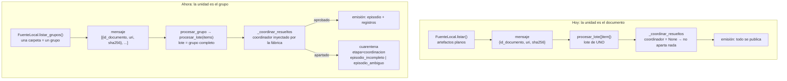

# Diseño: procesamiento por grupo

## Enfoque técnico

La unidad de trabajo pasa de ser el documento a ser el **grupo**: la carpeta de un paciente,
que según el instituto trae los estudios de un mismo episodio. Con eso el coordinador —que ya
existe, ya funciona y ya está probado— recibe en un solo lote todo lo que necesita para decidir,
sin máquina de estados de corrida, sin `corrida_id` y sin área de retención.

El cambio se apoya en tres piezas y ninguna es nueva lógica clínica:

1. **La ingesta aprende a enumerar grupos.** El puerto gana `listar_grupos()`; la carpeta es el
   grupo. El conocimiento de filesystem sigue viviendo donde ya vivía.
2. **La cola transporta un grupo de referencias.** `procesar_grupo` reemplaza a
   `procesar_documento`. El invariante no cambia: sigue siendo un conjunto de
   `{id_documento, uri, sha256}`, nunca contenido ni PII.
3. **La raíz de composición inyecta el coordinador.** El default `coordinar_episodios=None` del
   ejecutor se queda; lo que cambia es que `construir_fabrica_ejecutor` deje de aceptarlo.

Y una corrección independiente que viaja con el cambio: los códigos de cuarentena de nivel
episodio dejan de compartir nombre con los de nivel campo.

## Decisiones de arquitectura

### Decisión 1: el mensaje transporta las referencias del grupo, no la carpeta

**Elección**: `procesar_grupo(referencias: list[dict[str, str]])`, donde cada referencia tiene
exactamente `{id_documento, uri, sha256}`. La tarea las convierte a `ItemLote` y llama
`procesar_lote(items)` una sola vez.

| Opción | Costo | Veredicto |
|---|---|---|
| **(a) Lista de referencias** | El mensaje crece de 1 a N referencias (~4); la firma deja de ser la prueba por construcción del invariante | **Elegida** |
| (b) `uri` del directorio + `listar()` en el trabajador | El trabajador re-enumera: el `sha256` se calcula ahí, así que la identidad del trabajo **no está en el mensaje**; un reintento sobre una carpeta que cambió procesa otro grupo. Además `construir_fabrica_ejecutor` fija `directorio=raices[0]` y arma **una** `FuenteLocal` compartida: listar por tarea obliga a cambiar la firma del puerto o a reconstruirla en cada mensaje | Rechazada |
| (c) Mantener la tarea por documento y agregar una por grupo | Conserva vivo el modo que la exploración condena: cuatro comportamientos en vez de tres | Rechazada |

**Fundamento**: el mensaje debe ser la descripción **completa e inmutable** del trabajo. La (b)
la rompe: dos entregas del mismo mensaje pueden significar cosas distintas. La (a) no toca
`FuenteLocal` ni el cableado de la fábrica.

**Costo aceptado y su mitigación**: hoy el invariante "sin PII en cola" es cierto *por
construcción* —la firma de tres parámetros no tiene por dónde colar otra cosa—. Una lista de
dicts pierde esa propiedad. Se reemplaza por una barrera explícita: la conversión extrae
**exactamente** esas tres claves y falla ruidoso ante cualquier clave extra, con un test
centinela que sustituye al actual `test_procesar_documento_solo_recibe_id_uri_sha256`.

`procesar_documento` **se elimina**. No tiene despachador de producción (el único llamador real
es `scripts/procesar_carpeta.py`, que no usa Celery), así que no hay mensajes en vuelo que
queden huérfanos.

### Decisión 2: la carpeta es el grupo, y eso lo sabe el puerto de ingesta

**Elección**: `FuenteDeArtefactos` gana `listar_grupos() -> Iterator[GrupoArtefactos]`;
`FuenteLocal` lo implementa tomando cada **subdirectorio inmediato** de `directorio` como un
grupo, reusando el hasheo por bloques, el tope de tamaño y la deduplicación que ya tiene.
`listar()` se mantiene sin cambios.

```python
@dataclass(frozen=True)
class GrupoArtefactos:
    id_grupo: str          # sha256 de la ruta del directorio: el nombre de carpeta puede ser PII
    artefactos: tuple[ArtefactoCrudo, ...]
```

**Alternativa descartada**: dejar `listar_grupos()` sólo en `FuenteLocal`. Obligaría al
despachador a tipar contra el adaptador concreto, que es exactamente lo que el puerto evita.

**Fundamento**: el core (`EjecutorPipeline`) no lo llama —sigue sin conocer `pathlib`—, pero el
despachador y el script sí son consumidores del puerto. Si mañana la fuente es un bucket, la
clase nueva tiene que decir qué es un grupo en su medio; eso es una virtud, no un costo.

**Gotcha**: la deduplicación por contenido es global a la enumeración. Un PDF idéntico presente
en dos carpetas se descarta en la segunda y ese grupo queda incompleto → cuarentena. Es la
verdad, no un bug: dos veces el mismo archivo es un documento, no dos.

### Decisión 3: el default del ejecutor se queda en `None`; la fábrica deja de aceptarlo

**Elección**: `EjecutorPipeline.__init__` conserva `coordinar_episodios=None`.
`construir_fabrica_ejecutor` pasa a inyectar `coordinar_episodios=coordinar_episodios` sin
parámetro para desactivarlo.

**Fundamento**: son dos afirmaciones distintas y viven en capas distintas.

- *"Un lote no es necesariamente un episodio"* es una propiedad del **core**. Sigue siendo cierta:
  hay tests y llamadores legítimos que procesan lotes arbitrarios.
- *"En producción el lote **es** un grupo, y por lo tanto valida"* es una decisión de **política**,
  y la política vive en la raíz de composición.

Poner el coordinador como default del ejecutor mezclaría las dos y volvería a esconder la
decisión donde nadie la ve.

**Qué pasa con el centinela** (`tests/pipeline/test_modo_sin_validacion_de_episodio.py`): se
**reescribe deliberadamente**, no se rompe ni se borra.

| Test | Destino |
|---|---|
| `test_un_lote_de_un_documento_no_puede_formar_un_episodio_completo` | Se conserva. Es la razón por la que la unidad de trabajo cambió. |
| `test_el_mismo_lote_con_los_tres_tipos_si_aprueba` | Se conserva. |
| `test_el_ejecutor_sin_coordinador_no_aparta_ningun_documento` | Se conserva la aserción de firma, con docstring nuevo: el default es `None` porque el core no asume que el lote sea un episodio, **no** porque el worker no pueda validar. |
| *(nuevo)* `tests/trabajadores/test_fabrica_inyecta_coordinador.py` | Centinela inverso: `construir_fabrica_ejecutor` MUST producir un ejecutor con coordinador. Si alguien lo desconecta, explota. |

El archivo se renombra a `test_contrato_de_coordinacion_de_episodio.py`: su título ya no describe
una limitación vigente.

### Decisión 4: códigos propios para el nivel episodio, y una etapa propia

**Elección**: dos códigos nuevos en `CodigoErrorDocumento`, y `_CODIGO_CUARENTENA_POR_MOTIVO`
apunta a ellos. `COBERTURA_AMBIGUA`/`COBERTURA_INCOMPLETA` quedan como **exclusivos** de
reconciliación (nivel campo).

| Motivo del coordinador | Antes | Ahora |
|---|---|---|
| `ASOCIACION_AMBIGUA` | `cobertura_ambigua` | `episodio_ambiguo` |
| `ESTUDIOS_FALTANTES` | `cobertura_incompleta` | `episodio_incompleto` |

Además `Etapa.COORDINACION = "coordinacion"` y `EtapaDocumento.COORDINACION = "coordinacion"`;
`_coordinar_resueltos` deja de etiquetar sus fallos como `reconciliacion`.

**Alternativa descartada**: separar sólo los códigos y dejar la etapa en `"reconciliacion"`. Con
códigos distintos la etapa ya no hace falta para desambiguar —pero seguiría **mintiendo** sobre
dónde ocurrió el fallo, y la coordinación es la única etapa que opera sobre el lote entero.

**Impacto medido, no supuesto**:

- `observabilidad/bitacora_segura.py::CODIGOS_SEGUROS` se deriva por comprensión de
  `CodigoErrorDocumento`: absorbe los códigos nuevos **sin tocar una línea**.
- La tabla `cuarentena` declara `etapa` y `codigo` como `String` planos, sin enum ni
  `CHECK` (`salida/modelos_orm.py`): **no hace falta migración**. Las filas ya escritas conservan
  sus valores viejos, que siguen siendo códigos válidos del enum.
- Cualquier consumidor que filtre por `etapa == "reconciliacion"` deja de ver las cuarentenas de
  episodio. Es el efecto buscado.

### Decisión 5: `scripts/procesar_carpeta.py` pasa a validar, usando la misma fábrica

**Elección**: el script deja de armar el `EjecutorPipeline` a mano y lo obtiene de
`construir_fabrica_ejecutor(...)()`. Consecuencia directa: valida completitud de episodio.

**Alternativa descartada**: agregar `--sin-validacion-de-episodio`. Preservaría por bandera
exactamente el tercer comportamiento que este cambio elimina. Si aparece una necesidad real de
depurar parsers sobre PDFs sueltos, se agrega entonces y con evidencia.

**Fundamento**: el script es hoy el único camino de producción que corre de punta a punta.
Que tenga un cableado propio es cómo se produjo la deriva; borrar ese cableado es lo que impide
que vuelva a producirse. Sigue procesando el directorio entero como **un** lote —el coordinador
agrupa por ancla y paciente igual que antes—, así que no necesita `listar_grupos()`.

**Costo explícito**: apuntar el script a una carpeta de PDFs sueltos ahora manda casi todo a
cuarentena con `episodio_incompleto`. No es una regresión: es el resultado correcto, que antes
quedaba oculto.

## Recorrido



## Cambios de archivos

| Archivo | Acción | Descripción |
|---|---|---|
| `src/anonimizacion/dominio/errores.py` | Modificar | `EPISODIO_INCOMPLETO`, `EPISODIO_AMBIGUO`; `EtapaDocumento.COORDINACION` |
| `src/anonimizacion/pipeline/etapas.py` | Modificar | `Etapa.COORDINACION` |
| `src/anonimizacion/pipeline/ejecutor.py` | Modificar | `_CODIGO_CUARENTENA_POR_MOTIVO` a los códigos nuevos; `_coordinar_resueltos` etiqueta `etapa=Etapa.COORDINACION.value` |
| `src/anonimizacion/ingesta/fuente.py` | Modificar | `GrupoArtefactos`; `listar_grupos()` en el `Protocol` y en `FuenteLocal` |
| `src/anonimizacion/trabajadores/tareas.py` | Modificar | `procesar_grupo` reemplaza a `procesar_documento`; conversión con extracción estricta de claves; la fábrica inyecta `coordinar_episodios` |
| `scripts/procesar_carpeta.py` | Modificar | Usa `construir_fabrica_ejecutor`; borra el cableado propio del ejecutor |
| `tests/pipeline/test_modo_sin_validacion_de_episodio.py` | Renombrar + reescribir | → `test_contrato_de_coordinacion_de_episodio.py` (ver Decisión 3) |
| `tests/trabajadores/test_fabrica_inyecta_coordinador.py` | Crear | Centinela inverso sobre la fábrica |
| `tests/trabajadores/test_tareas.py` | Modificar | Tests de `procesar_grupo`; centinela de claves permitidas |
| `tests/integracion/test_wiring_produccion.py` | Modificar | Pasa de 1 documento a un grupo de 3 (ver migración) |
| `tests/carga/ejecutar_corpus.py` | Modificar | Sólo los nombres de código del oráculo |
| `tests/ingesta/test_fuente_local.py` | Modificar | Cobertura de `listar_grupos()` |

## El invariante de los oráculos de carga

Hoy: `{"cobertura_ambigua": 8, "cobertura_incompleta": 17, "parseo_incompleto": 1}` = **26**.

Después: `{"episodio_ambiguo": 8, "episodio_incompleto": 17, "parseo_incompleto": 1}` = **26**.

**El total DEBE permanecer en 26. Si cambia, es un bug, no un efecto esperado.** Y no sólo el
total: cada conteo individual se conserva, porque en el corpus sintético las 25 cuarentenas
`cobertura_*` provienen **todas** del coordinador. La aritmética lo demuestra a partir de
`_COMPOSICION_CARGA_1000`:

| Caso | Cantidad | Documentos apartados | Código |
|---|---|---|---|
| `ambiguo` | 2 | 4 c/u (tres tipos + un laboratorio extra) = 8 | episodio ambiguo |
| `faltante` | 3 | 2 c/u = 6 | episodio incompleto |
| `separacion_8` | 3 | 3 c/u (la ventana de ±7 días parte el caso en dos episodios incompletos) = 9 | episodio incompleto |
| `corrupto` | 1 | 1 en parseo + los 2 hermanos que quedan sin eco | parseo + episodio incompleto |

8 + (6 + 9 + 2) + 1 = 26, y `8 + 17 = 25` son exactamente las de nivel episodio. **Cero**
cuarentenas de nivel campo en el corpus: por eso la separación de códigos es un renombre puro.

**Cómo se verifica**: los oráculos ya son de igualdad estricta (`if actual != oraculo: raise`),
así que corregir sólo las claves y correr el escalón de 1.000 es la prueba. Se agrega un
invariante explícito, comprobable sin correr el corpus:

> `sum(ORACULO_CARGA_1000.cuarentena_por_codigo.values()) == 26`, y la suma de los códigos de
> nivel episodio == 25.

`escalar_oraculo` multiplica linealmente, así que `ORACULO_CARGA_10000` se deriva solo: 260.

**Por qué el cambio de forma del lote no mueve los conteos**: el corpus deriva `id_paciente` del
prefijo `caso-NNN` del nombre de archivo, así que no existen episodios que crucen casos. Procesar
todo en un lote o caso por caso da idénticos episodios. Que el banco de carga adopte la fábrica
de producción queda fuera de alcance y no altera este invariante.

## Estrategia de pruebas

| Capa | Qué se prueba | Cómo |
|---|---|---|
| Unitaria | `listar_grupos()` devuelve un grupo por subdirectorio, con sus artefactos | `tmp_path` con dos carpetas sintéticas |
| Unitaria | `listar_grupos()` hereda tope de tamaño, cuarentena por sobretamaño y dedup | Reuso de los fakes ya existentes de `FuenteLocal` |
| Unitaria | Una referencia con una clave extra hace fallar `procesar_grupo` | Diccionario con una cuarta clave inventada |
| Unitaria | Los dos motivos del coordinador mapean a los códigos nuevos y a `etapa="coordinacion"` | Tabla sobre `_CODIGO_CUARENTENA_POR_MOTIVO` |
| Unitaria | `CODIGOS_SEGUROS` contiene los códigos nuevos sin tocar `bitacora_segura` | Aserción de pertenencia |
| Unitaria | `construir_fabrica_ejecutor` produce un ejecutor con coordinador | Introspección del ejecutor construido |
| Integración | Un grupo de tres tipos se publica entero | `test_wiring_produccion` migrado |
| Integración | Un grupo de dos tipos va entero a cuarentena con `episodio_incompleto` | Mismo fixture, sin el eco |
| Integración | Un grupo con dos laboratorios va a cuarentena con `episodio_ambiguo` | Mismo fixture, laboratorio duplicado |
| Carga | Total de cuarentenas = 26; nivel episodio = 25 | Aserción sobre el oráculo + corrida del escalón de 1.000 |

## Migración de los tests que dependen del comportamiento actual

| Test | Qué asume hoy | Migración |
|---|---|---|
| `tests/integracion/test_wiring_produccion.py` | Un documento suelto termina en `exito` | Con el coordinador inyectado terminaría en cuarentena. Se construye un grupo de tres (laboratorio + ECG + eco) con los fixtures sintéticos de `tests/fixtures/v1/documentos.py` y se afirma éxito de los tres. **Se conserva la razón de ser del test**: la `uri` sigue viajando como en un mensaje real, y una raíz no autorizada sigue dando `PermissionError` |
| `tests/trabajadores/test_tareas.py` | Firma de tres parámetros; `_EjecutorFake` desempaqueta `(item,) = items` | Se reescribe contra `procesar_grupo`; el fake pasa a devolver un resultado por ítem |
| `tests/pipeline/test_modo_sin_validacion_de_episodio.py` | El default `None` significa "el worker no puede validar" | Reescritura deliberada, detallada en la Decisión 3 |
| `tests/carga/ejecutar_corpus.py` | Claves `cobertura_*` en el oráculo | Renombre de claves; conteos intactos |
| Cualquier test que afirme `codigo == "cobertura_incompleta"` sobre salida del coordinador | Código compartido | `rg "cobertura_"` antes de tocar nada; los de reconciliación (nivel campo) **no** se tocan |

## Fuera de alcance

La coordinación al cierre de corrida y la máquina de estados de corrida; cinecoronariografía;
que el banco de carga use la fábrica de producción; el despachador de producción que enumera
grupos y los encola (`listar_grupos()` queda listo para él).

## Preguntas abiertas

- [ ] Ninguna que bloquee la implementación.
