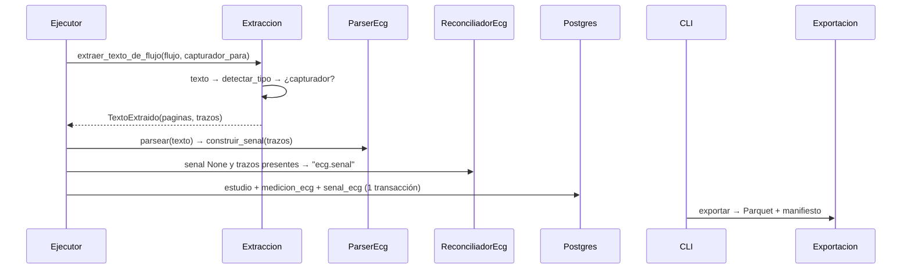
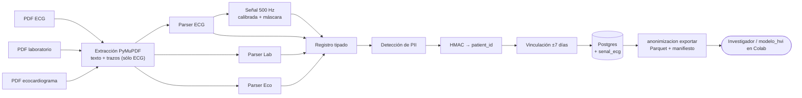

# Diseño: señal de ECG y dataset vinculado

## Enfoque técnico

El PDF se abre **una sola vez**. Si el texto se detecta como ECG, ese mismo documento abierto entrega sus trazos negros (geometría, nunca texto) dentro de `TextoExtraido`. El parser ECG los convierte en `SenalEcg` (500 Hz, µV `int16`, máscara) con funciones numpy puras. Si el layout no valida, `senal=None` y el reconciliador agrega `ecg.senal` a `campos_no_extraidos`: el ECG se publica incompleto, no va a cuarentena. La señal se escribe en `senal_ecg` en la misma transacción que el `estudio`. `anonimizacion exportar` lee la base en streaming y escribe Parquet + `manifiesto.json`.

## Decisiones

| # | Tema | Elegido | Rechazado | Tradeoff |
|---|---|---|---|---|
| 1 | Convivencia con `TextoExtraido` | `extraer_texto_de_flujo(flujo, *, capturador_para=None)`: con el documento abierto, el ejecutor inyecta `detectar_tipo` + registro `{ECG: capturar_trazos}`; `TextoExtraido.trazos = ()` por defecto | `get_drawings()` en los 3 tipos; guardar bytes y reabrir; cambiar el contrato `extraer` | `detectar_tipo` corre dos veces (búsqueda de subcadena, microsegundos) a cambio de un solo `open`, Strategy intacto y fakes de tests sin cambios |
| 2 | Asignación de derivaciones | Sólo geometría: grilla 3×4 + tira, orden `EsquemaPdf` | Rótulos de texto | Nunca lee texto. Un layout distinto falla la validación en vez de reasignar mal |
| 3 | Almacenamiento | `senal_ecg` con PK = FK `id_estudio`; `int16` µV little-endian + zlib; máscara `packbits` + zlib; `STORAGE EXTERNAL` | `float32` (~4× más grande, comprime mal); columnas en `medicion_ecg`; `.npz` | Cuantización de 1 µV (≪ 0,01 mV); ±32,7 mV supera los 21,6 mV que caben en la hoja; ~35 KB/ECG, ~3,5 GB/100k en RDS |
| 4 | Formato de exportación | `episodios`, `ecg`, `laboratorio` y `eco` `.parquet` (zstd) unidos por `id_episodio`; señal `FixedSizeList<int16>[60000]` + máscara `FixedSizeList<bool>` | Fila ancha por episodio (el laboratorio es EAV); `.npy` por episodio (100k archivos que Drive sufre); blob binario (exige conocer el codec) | Se lee con `reshape(-1, 12, 5000)` sin copia; el investigador hace un join |
| 5 | Streaming | Una transacción `REPEATABLE READ`, paginación por clave (`id_episodio > último`, lotes de 256), un `ParquetWriter` por tabla, un row group por lote; se escribe en `<salida>.tmp` y se renombra; el manifiesto va último | `OFFSET` (cuadrático); un cursor del servidor por tabla | Memoria acotada (~30 MB por lote); instantánea consistente aunque el pipeline siga escribiendo |
| 6 | Cero PII | Lista blanca explícita de columnas (nunca `SELECT *`); quedan afuera `clave_documento`, `corrida_id`, `id_medico*` y el texto libre del eco | Exportar todo lo "ya anonimizado" | Un test fija el esquema exacto de cada Parquet |
| 7 | Verificador PII | Aho-Corasick en Python puro sobre valores distintos con multiplicidad; por registro suma las multiplicidades presentes (el valor vacío cuenta en todos) | Índice de tokens (cambia la semántica de subcadena); regex alternada (no lineal) | O(texto + patrones); test de equivalencia contra la versión cuadrática con semillas |
| 8 | Dependencias | `numpy>=1.26` (ya llega como transitiva de spaCy) y `pyarrow>=15` como dependencias base | Extra opcional `[exportacion]` | +~40 MB con wheels de Windows sin compilar; `instalar.ps1` no cambia; hay que regenerar `uv.lock` |

## Algoritmo (`extraccion/senal_ecg.py`, puro)

1. **Captura** (`extraccion/trazos_pymupdf.py`): `get_drawings()`, sólo trazos `color == (0,0,0)` sin relleno. Los puntos se llevan al espacio **sin rotar** (`page.derotation_matrix` si `page.rotation`) y a mm (×25,4/72). El tiempo es el eje vertical sin rotar.
2. **Calibración**: el pulso de cada fila (~60 puntos) da la línea base (su pie) y debe medir 10 mm ±2 % (= 1 mV). Si el texto dice `N mm/mV` con N ≠ 10, falla.
3. **Asignación**: se agrupa por fila (centro de amplitud) y por columna (inicio temporal).
4. **Conversión**: t = mm/25 s; mV = desplazamiento/10. Si los puntos no son equiespaciados (desvío > 1 %), se interpola linealmente a una grilla de 500 Hz.
5. **Ubicación**: los tramos van en las muestras 0/1250/2500/3750 (1238 cada uno) y la tira V1 ocupa las 5000. Resultado: matriz (12, 5000) + máscara.
6. **Validación estricta, todo o nada**: 12 trazos de 1238±2 muestras, 1 de 5000±2, 4 pulsos y filas disjuntas. Cualquier fallo da `senal=None`.

## Flujo



## Diagrama de arquitectura (nota de Obsidian)



## Interfaces

```python
@dataclass(frozen=True, eq=False)  # eq=False: comparar ndarray con == es ambiguo
class SenalEcg:
    muestras_uv: np.ndarray  # int16 (12, 5000)
    mascara: np.ndarray      # bool (12, 5000)
    frecuencia_hz: int = 500
    version_extractor: int = 1
    def __repr__(self) -> str: return "SenalEcg(12x5000@500Hz)"  # nunca volcar muestras
```

`ContenidoEcg.senal` y `ContenidoEcgSalida.senal` son `SenalEcg | None = None`. El manifiesto declara la versión del formato, Hz, unidad y escala, el orden de derivaciones, la forma, las ventanas (inicio_s, muestras), la derivación de ritmo, los conteos y el sha256 de cada archivo.

## Archivos

| Archivo | Acción |
|---|---|
| `extraccion/trazos_pymupdf.py`, `extraccion/registro_trazos.py`, `extraccion/senal_ecg.py`, `dominio/senal_ecg.py` | Crear |
| `salida/codec_senal.py`, `salida/exportacion.py`, `migrations/versions/0013_senal_ecg.py` | Crear |
| `extraccion/texto_pymupdf.py`, `pipeline/ejecutor.py`, `parseo/ecg_mortara.py`, `reconciliacion/ecg_mortara.py`, `dominio/referencias.py` (`ecg.senal`) | Modificar |
| `salida/{modelos_salida,constructor_registro,modelos_orm,destinos/postgres}.py`, `cli.py`, `pyproject.toml` | Modificar |
| `tests/fixtures/{pdf_sintetico,plantilla_documento,corpus_piloto}.py`, `tests/fixtures/verificador_pii.py` | Modificar / crear |

## Testing

| Capa | Qué |
|---|---|
| Unitario | `construir_senal` con polilíneas sintéticas: equiespaciadas, no equiespaciadas y cada violación del layout. Ida y vuelta del codec. Equivalencia Aho-Corasick vs. versión cuadrática |
| Integración | PDF sintético rotado 90° con grilla roja y trazos del oráculo: error ≤ 0,01 mV. Idempotencia de `senal_ecg`. Migración 0013 arriba/abajo |
| Contrato | La exportación decimada ×2 da (12, 2500) y la máscara coincide con `EsquemaPdf` (constantes copiadas, sin importar `modelo_hvi`) → 24 canales |
| Seguridad | Corpus sintético → exportar → 0 coincidencias de PII; el esquema de cada Parquet es igual a la lista blanca |

## Migración

`0013_senal_ecg`: crea la tabla, con `ON DELETE CASCADE` desde `estudio` y `SET STORAGE EXTERNAL` sólo en Postgres. El downgrade la elimina. No hay backfill.

## Preguntas abiertas

- [ ] ¿`get_drawings()` devuelve coordenadas rotadas o sin rotar? El test del PDF rotado lo fija antes de implementar.
- [ ] ¿Fechas absolutas o desfase relativo en la exportación? Lo decide el comité.
- [ ] Los estudios ya escritos sin señal se saltean por idempotencia. Hoy no importa (todavía no hay base productiva); un re-extractor queda para otro cambio.
